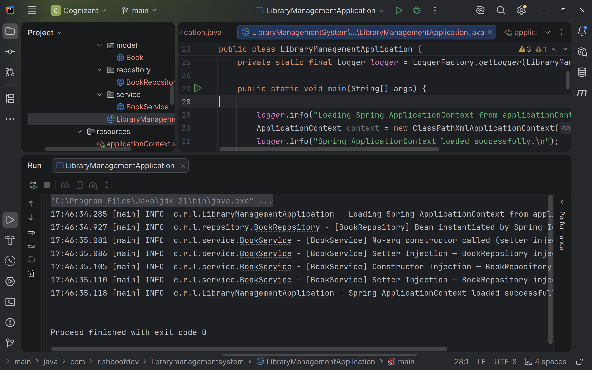
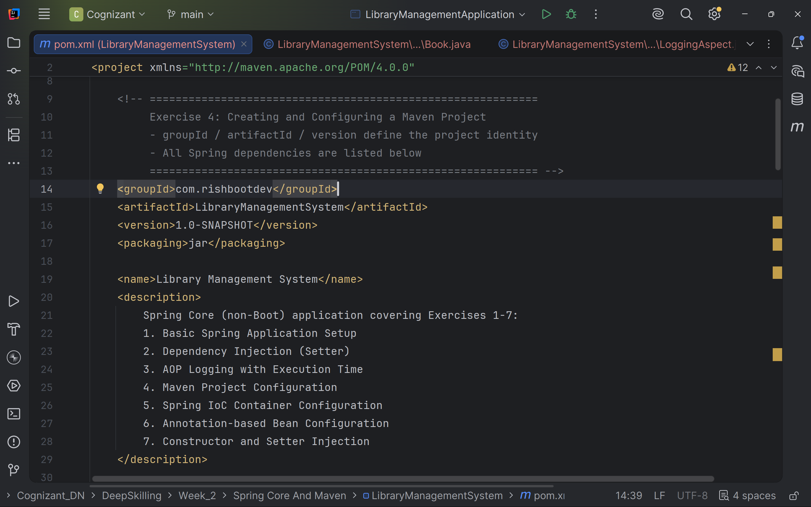
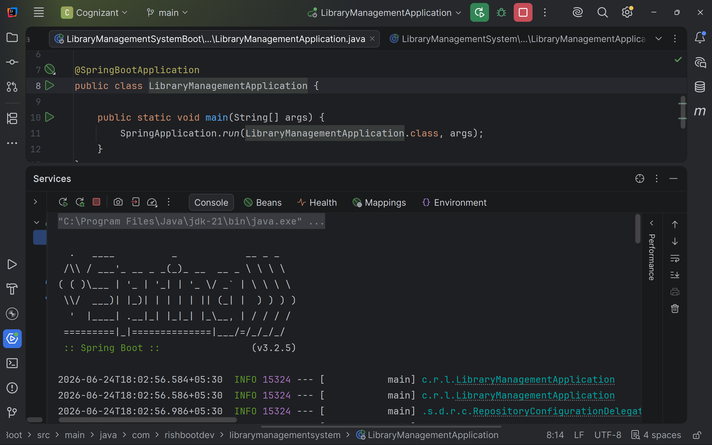

# Spring Core & Maven Hands-on

**Application Name:** LibraryManagement  
**Package Name:** `com.cognizant.rishbootdev.librarymanagementsystem`

This project demonstrates the fundamentals of the Spring Framework, including Spring Core, Dependency Injection (IoC), Spring AOP, XML Configuration, Annotation-based Configuration, Constructor & Setter Injection, Maven configuration, and a basic Spring Boot application. All exercises from the hands-on document have been implemented.

---

## Exercise 1 – Configuring a Basic Spring Application
**Implemented:**
- Maven project creation
- Spring Core dependencies
- XML-based bean configuration
- BookService
- BookRepository
- Main class to load Spring context

**Output:**  

---

## Exercise 2 – Implementing Dependency Injection
**Implemented:**
- Setter Injection
- XML bean wiring
- Dependency Injection using Spring IoC Container

**Output:**  

---

## Exercise 3 – Implementing Logging with Spring AOP
**Implemented:**
- Spring AOP
- Logging Aspect
- Method execution time logging
- AspectJ Auto Proxy

**Output:**  

---

## Exercise 4 – Creating and Configuring a Maven Project
**Implemented:**
- Maven project
- Spring Context
- Spring AOP
- Spring WebMVC dependencies
- Maven Compiler Plugin configuration

**Output:**  

---

## Exercise 5 – Configuring the Spring IoC Container
**Implemented:**
- XML Bean Configuration
- IoC Container
- Bean Initialization
- Dependency Injection

**Output:**  

---

## Exercise 6 – Configuring Beans with Annotations
**Implemented:**
- `@Service`
- `@Repository`
- Component Scanning
- Annotation-based Bean Configuration

**Output:**  

---

## Exercise 7 – Constructor and Setter Injection
**Implemented:**
- Constructor Injection
- Setter Injection
- XML Constructor Configuration

**Output:**  

---

## Exercise 8 – Basic Spring AOP
**Implemented:**
- Before Advice
- After Advice
- Logging Aspect
- AspectJ Auto Proxy

**Output:**  

---

## Exercise 9 – Spring Boot Application
**Implemented:**
- Spring Boot Project
- Spring Web
- Spring Data JPA
- H2 Database
- Book Entity
- Book Repository
- Book REST Controller
- CRUD Operations

**Output:**

*H2 Console - Login*  

*H2 Console - Connected*  

*H2 Console - Query Results*  

*API Documentation (Swagger UI)*  
  

---

## Technologies Used
- Spring Core
- Spring Boot 3
- Spring AOP
- Spring Context
- Spring WebMVC
- Spring Data JPA
- H2 Database
- Maven
- Lombok
- SLF4J Logging
- IntelliJ IDEA

## Project Features
- XML-based Bean Configuration
- Spring IoC Container
- Dependency Injection (Setter & Constructor)
- Annotation-based Bean Configuration
- Spring AOP Logging
- Maven Build Configuration
- Spring Boot REST Application
- CRUD Operations using Spring Data JPA
- Builder Pattern
- Lombok Integration
