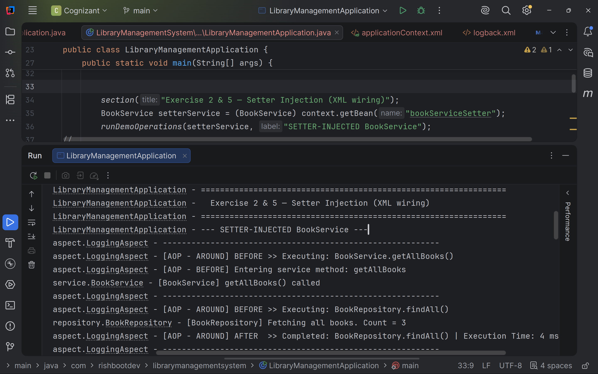
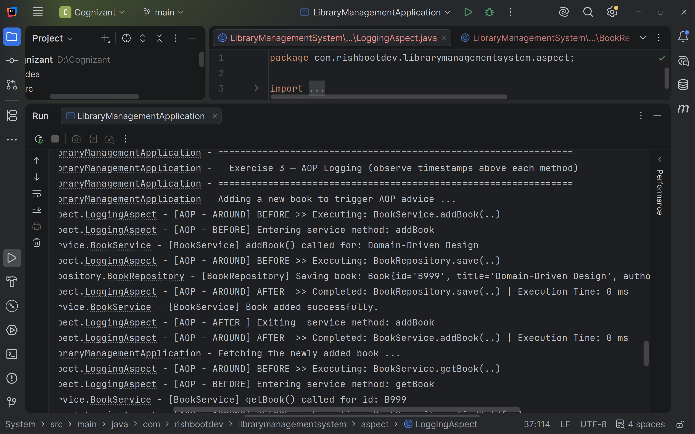
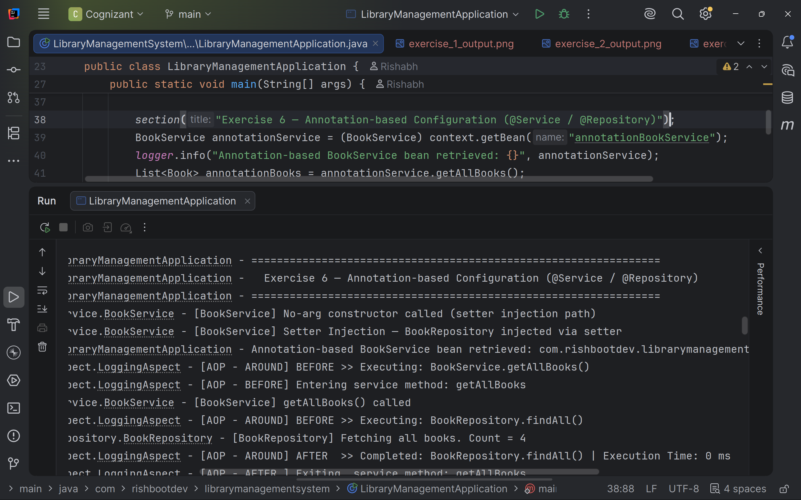
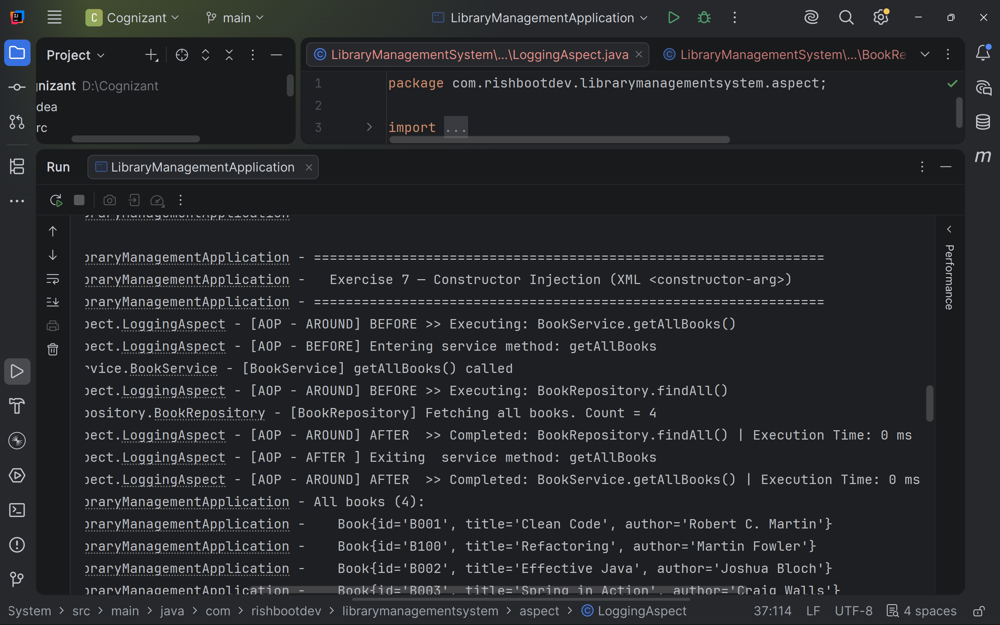
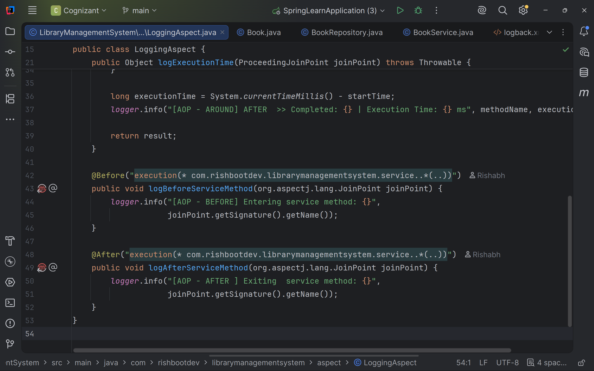

# Spring Core & Maven Hands-on

**Application Name:** LibraryManagement  
**Package Name:** `com.cognizant.librarymanagementsystem`

This module focuses on the absolute fundamentals of the Spring Framework. By progressing through these 9 exercises, we transition from classic XML-based configurations all the way to a modern Spring Boot REST application.

---

## Exercise 1 – Configuring a Basic Spring Application
**Implemented:**
- Maven project creation with Spring Core dependencies
- XML-based bean configuration
- `BookService`, `BookRepository`, and a Main class to load the Spring context.

**Output:**  

---

---

## Exercise 2 – Implementing Dependency Injection
**Implemented:**
- Setter Injection & XML bean wiring.
- Demonstrating Dependency Injection using the Spring IoC Container.

**Output:**  

---

---

## Exercise 3 – Implementing Logging with Spring AOP
**Implemented:**
- Spring AOP and AspectJ Auto Proxy.
- Created a `LoggingAspect` to intercept and log the execution time of method calls.

**Output:**  

---

---

## Exercise 4 – Creating and Configuring a Maven Project
**Implemented:**
- Configuring Spring Context, Spring AOP, and Spring WebMVC dependencies.
- Maven Compiler Plugin setup.

**Output:**  

---

---

## Exercise 5 – Configuring the Spring IoC Container
**Implemented:**
- Deep dive into XML Bean Configuration, IoC Container initialization, and Bean lifecycle.

**Output:**  

---

---

## Exercise 6 – Configuring Beans with Annotations
**Implemented:**
- Component Scanning (`@Service`, `@Repository`).
- Transitioning away from XML to Annotation-based Bean Configuration.

**Output:**  

---

---

## Exercise 7 – Constructor and Setter Injection
**Implemented:**
- Comparing Constructor Injection vs. Setter Injection.
- XML `<constructor-arg>` configuration.

**Output:**  

---

---

## Exercise 8 – Basic Spring AOP
**Implemented:**
- Utilizing `@Before`, `@After`, and `@Around` Advice in the Logging Aspect.

**Output:**  

---

---

## Exercise 9 – Spring Boot Application
**Implemented:**
- Transitioned to a full Spring Boot REST API (`LibraryManagement_SpringBoot`).
- Integrated Spring Web and Spring Data JPA with an H2 Database.
- Exposed CRUD Operations via a `BookController`.

**Output:**  

---

---

