# Spring Data JPA with Hibernate

**Module:** Employee Management System & ORM Hands-on  
**Package Name:** `com.cognizant.employeemanagementsystem`

This module dives deep into Object-Relational Mapping (ORM) using Spring Data JPA and Hibernate. It features three isolated hands-on exercises and a capstone Employee Management System API.

---

## Included Projects

### 1. `orm-learn` (Hands-on 1)
This project focuses on basic entity mapping for `Country`, `Employee`, `Department`, `Skill`, and `Stock` and demonstrates custom Exception Handling (e.g., `CountryNotFoundException`).

#### Exercise 1 – Project Setup & Entity Creation
**Implemented:**
- Configured Spring Boot with Spring Data JPA.
- Created `Country` entity and mapped it to the database table.

**Output:**  
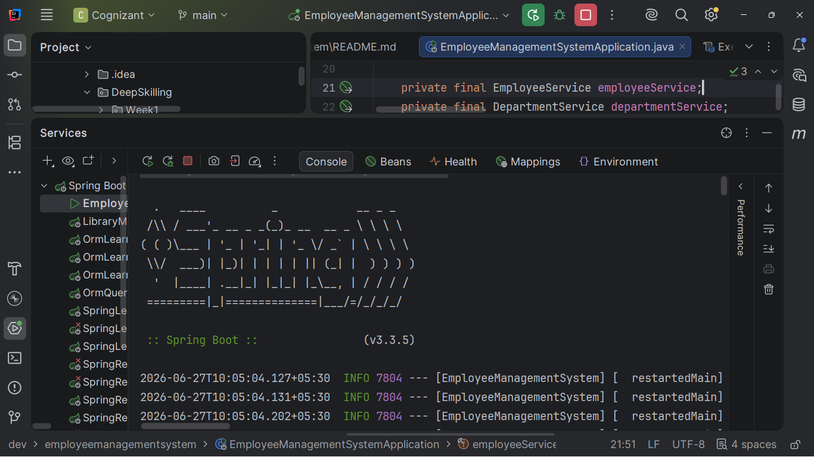

---

#### Exercise 2 – Fetching All Records
**Implemented:**
- Created `CountryRepository` interface extending `JpaRepository`.
- Used `findAll()` to retrieve all country records.

**Output:**  
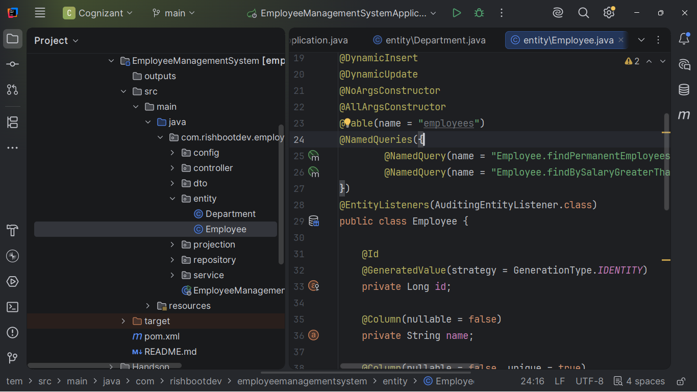

---

#### Exercise 3 – Fetching Record by ID
**Implemented:**
- Used `findById()` to retrieve a country by its code.
- Handled custom `CountryNotFoundException`.

**Output:**  
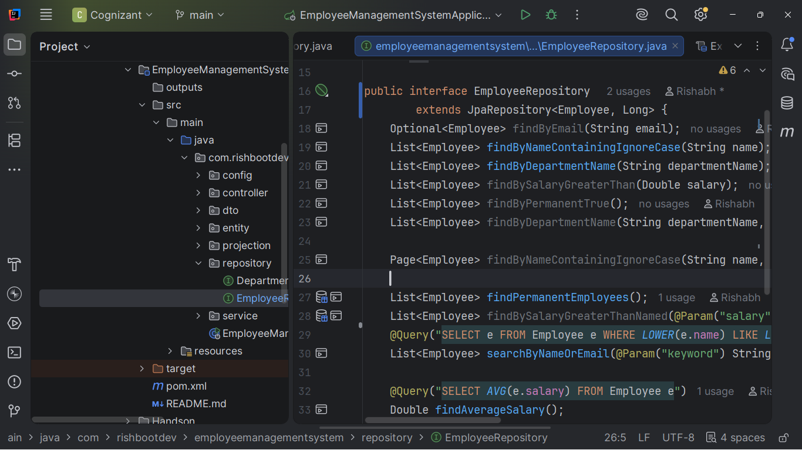

---

#### Exercise 4 – Adding a New Record
**Implemented:**
- Used `save()` to insert a new country into the database.

**Output:**  
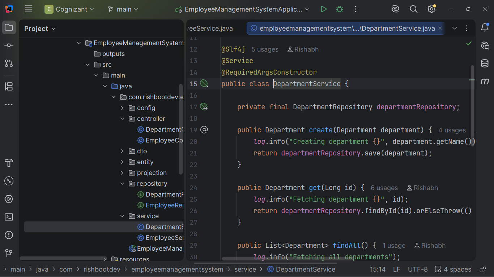

---

#### Exercise 5 – Updating a Record
**Implemented:**
- Retrieved a country by its ID, updated its name, and saved the changes.

**Output:**  

---

#### Exercise 6 – Deleting a Record
**Implemented:**
- Used `deleteById()` to remove a country record from the database.

**Output:**  
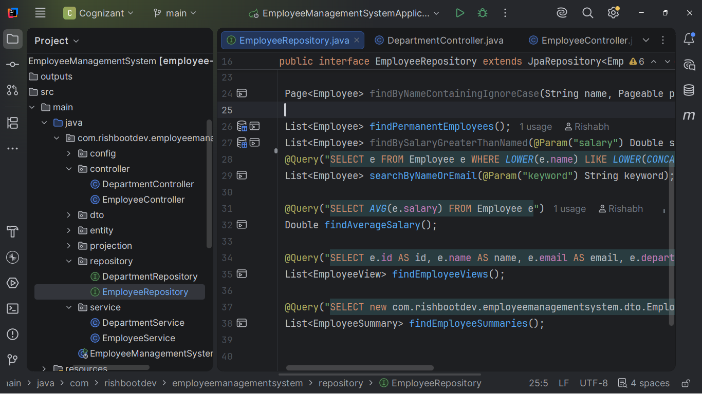

---

#### Exercise 7 – Custom Finder Methods (String Matching)
**Implemented:**
- Created custom query methods in `CountryRepository`.
- Searched countries by name containing a string and ordered by name.

**Output:**  
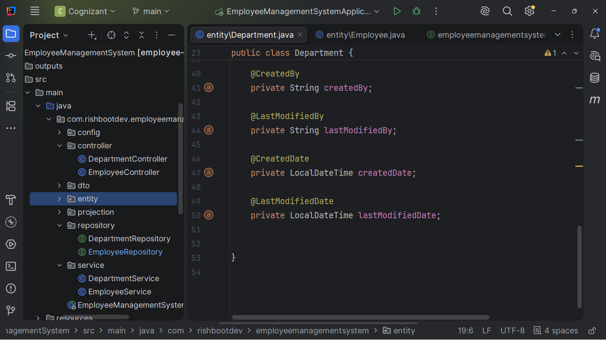

---

#### Exercise 8 – Custom Finder Methods (Starting With)
**Implemented:**
- Searched countries by name starting with a specific character.

**Output:**  
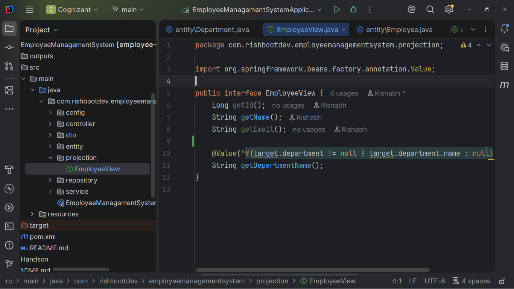

---

#### Exercise 9 – Custom Queries with Stock Entity
**Implemented:**
- Fetched stock data between specific dates.
- Fetched stock data with close price greater than a certain value.
- Fetched top 3 highest volume stock transactions.

**Output:**  
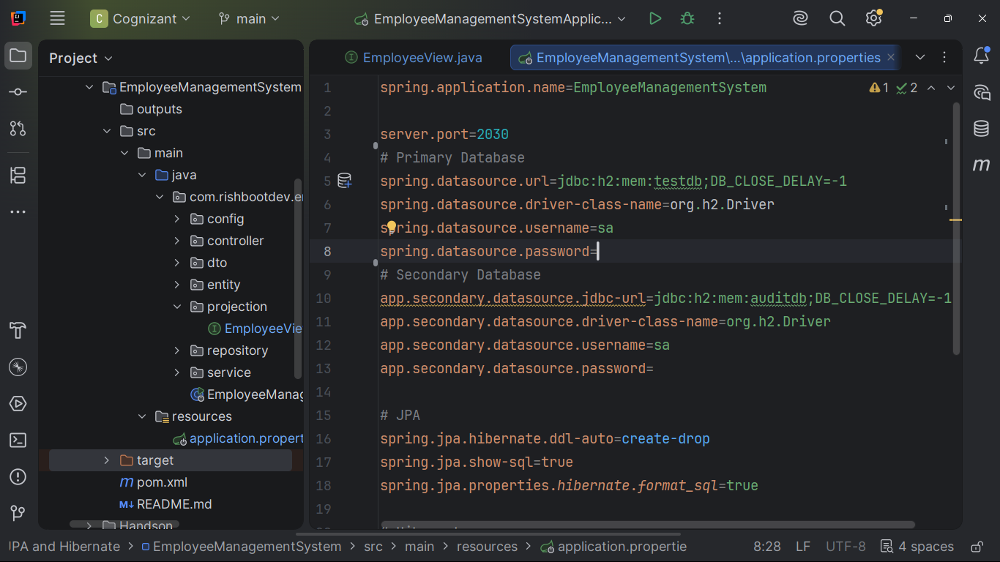

---

#### Exercise 10 – Relationship Mapping (Employee & Department/Skill)
**Implemented:**
- Mapped One-to-Many and Many-to-Many relationships for `Employee`, `Department`, and `Skill`.
- Fetched associated data seamlessly using Spring Data JPA.

**Output:**  
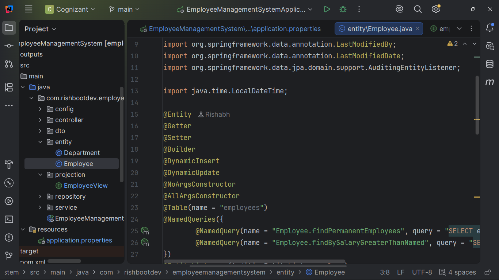  
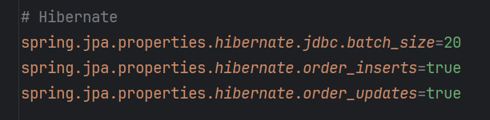

### 2. `spring-data-jpa-handson_2`
- Introduces the Service layer pattern.
- Implements `EmployeeService`, `DepartmentService`, and `SkillService` for structured business logic over basic repository calls.

**Output Logs:**
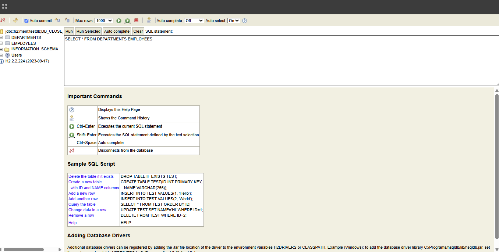

### 3. `spring-data-jpa-handson_3`
- Explores complex relationships (One-to-Many, Many-to-Many) via a Quiz system (`Attempt`, `Question`, `User`).
- Demonstrates advanced JPQL queries and projections.

**Output Logs:**
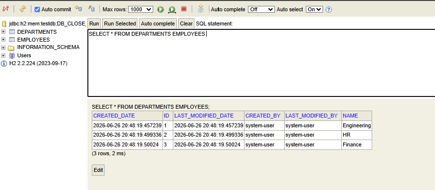

### 4. `EmployeeManagementSystem` (Capstone)
A complete, enterprise-ready REST API consolidating all ORM learnings.
- **DTO Pattern:** Utilizes `EmployeeRequest` and `EmployeeSummary` to decouple the database entity from the JSON payloads.
- **Auditing:** Features `AuditConfig` for automated timestamping.
- **Custom Queries:** Uses JPQL, native queries, and interface-based projections.

---

## API Documentation & Database Proof

To verify the robust implementation of the Employee Management System, an embedded H2 database is utilized alongside Swagger UI for seamless API testing.

### Swagger UI API Documentation
*Testing the full suite of CRUD operations seamlessly through the auto-generated OpenAPI spec.*

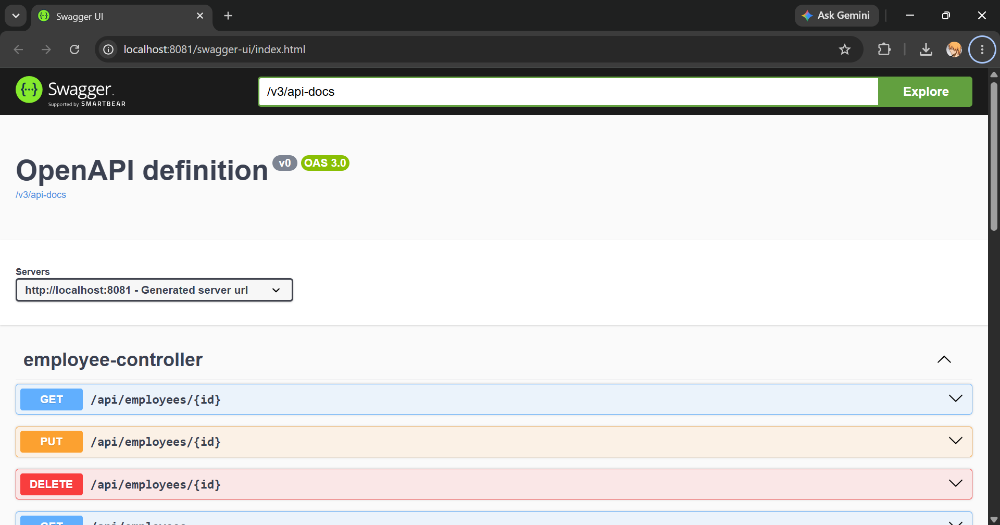  
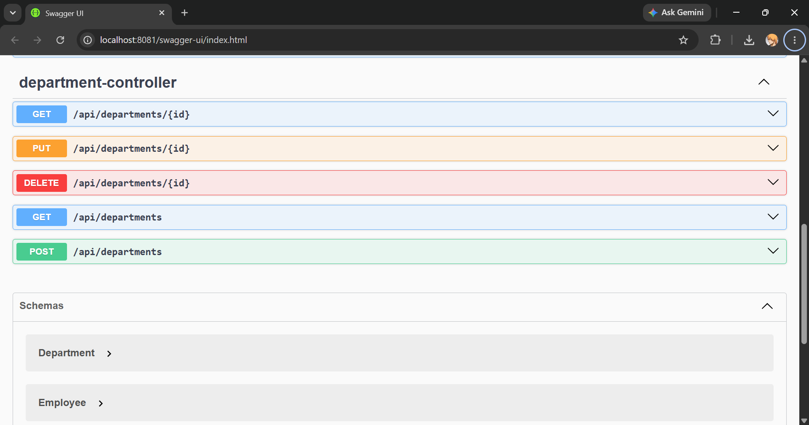

### H2 Database Console
*Proof of successful ORM mappings, table generation, and data persistence in memory.*

*Login Screen:*  
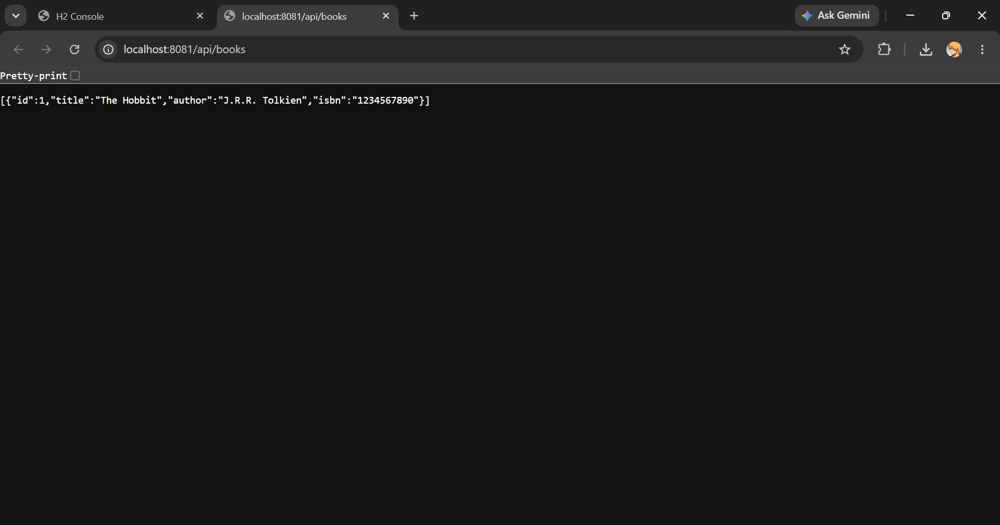

*Connected & Exploring Schema:*  
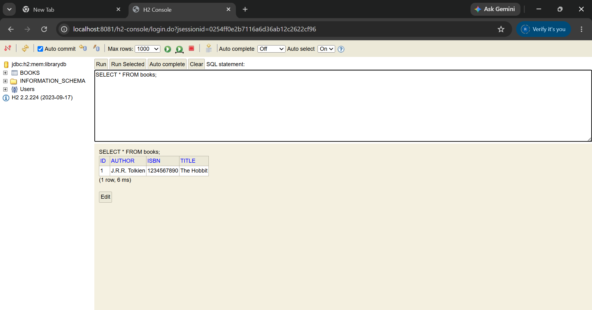

*Successful Query Execution:*  
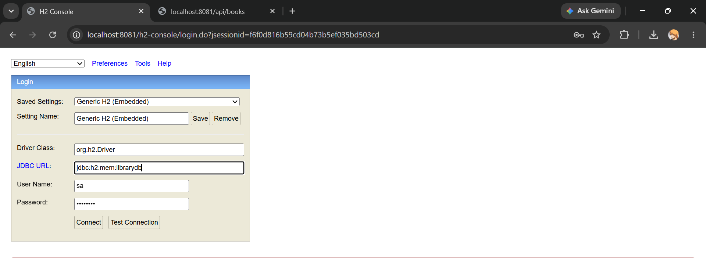

