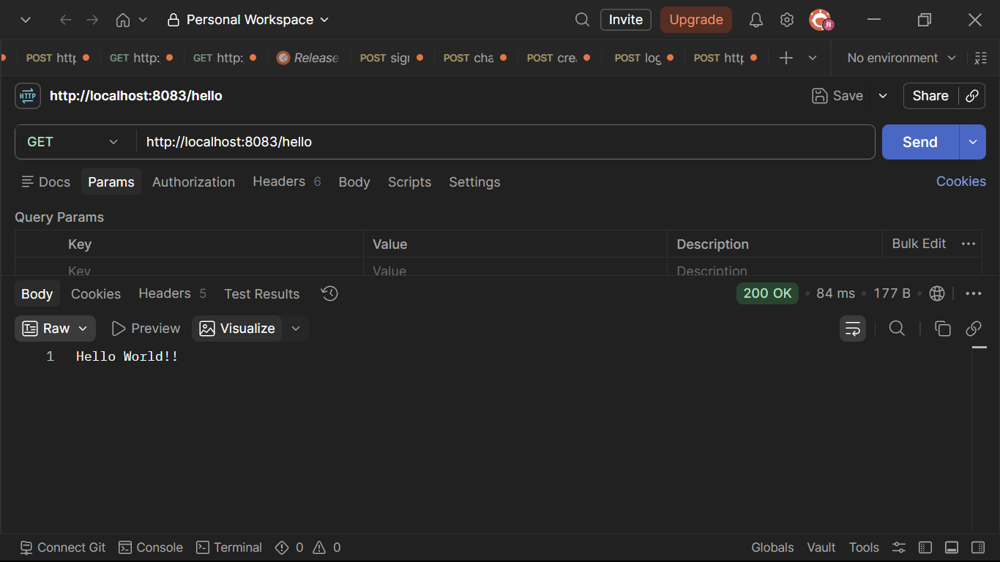
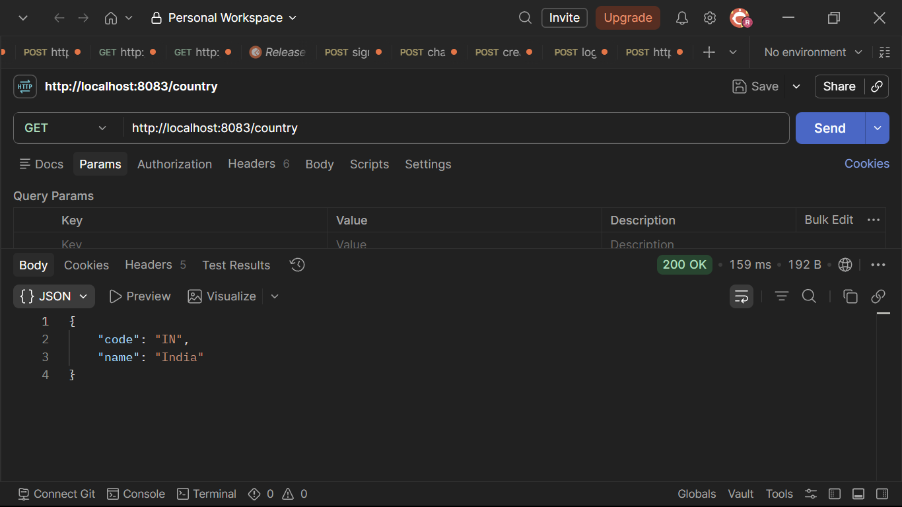
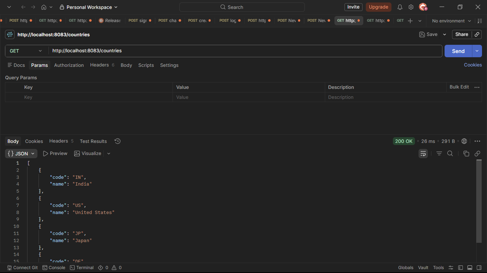
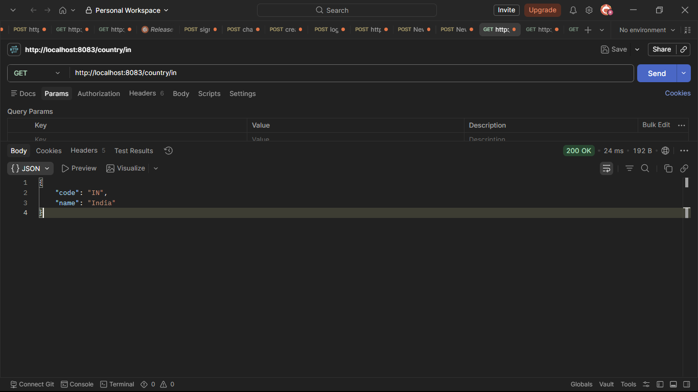
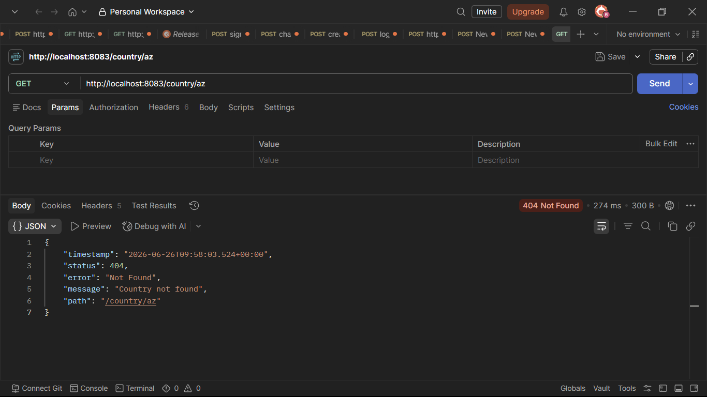
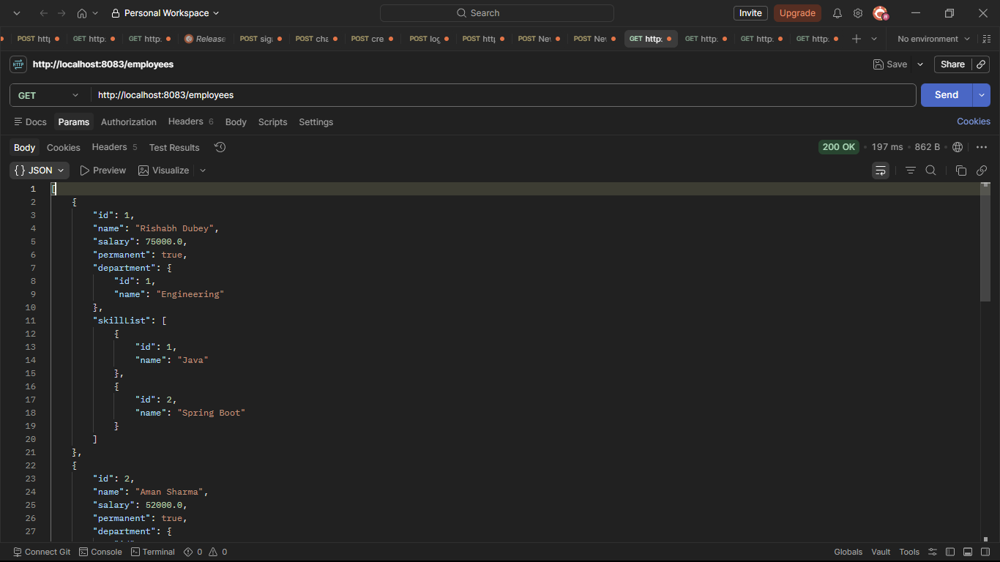
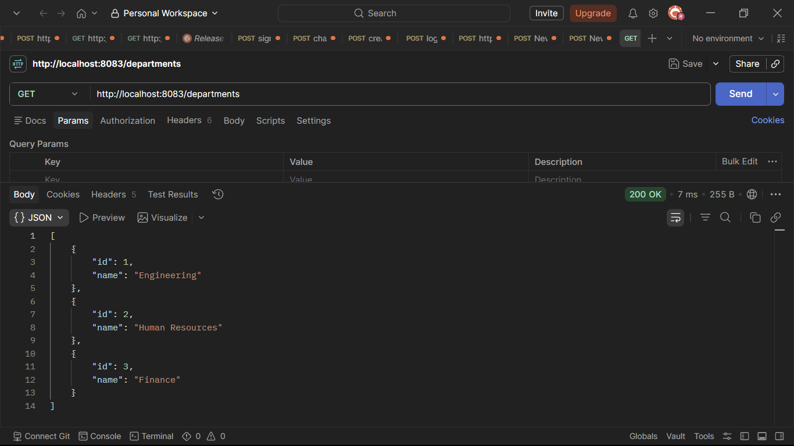

# Week 3: Spring Boot REST API & JWT Security

**Application Name:** spring-learn  
**Package Name:** `com.cognizant.springlearn`

This module covers the complete lifecycle of building, testing, and securing RESTful Web Services with Spring Boot 3. It is organized across 4 progressive hands-on sessions and a capstone JWT authentication project, each building upon the previous.

---

## Included Projects

| # | Project | Session Focus | Port |
|---|---------|---------------|------|
| 1 | `spring-rest-handson-1` | Spring Core: XML Beans, Scopes, Logging | 8080 |
| 2 | `spring-rest-handson-2` | REST Controllers, GET APIs, MockMvc Tests | 8083 |
| 3 | `spring-rest-handson-3` | Controller → Service → DAO Architecture | 8083 |
| 4 | `spring-rest-handson-4` | POST/PUT/DELETE, Validation, Global Exception Handler | 8090 |
| 5 | `jwt-spring-learn` | Spring Security + JWT Authentication | 8090 |

---

## Session 1 – Spring Core Fundamentals (`spring-rest-handson-1`)

**Implemented:**
- Created Spring Boot 3 Maven project using Spring Initializr.
- Loaded `SimpleDateFormat` bean from `date-format.xml` (Constructor Injection).
- Loaded `Country` bean from `country.xml` (Setter Injection).
- Demonstrated **Singleton vs Prototype** scope using `scope="prototype"`.
- Loaded a list of 4 countries from XML using `<list>` and `<ref>` elements.
- Incorporated SLF4J logging (`@Slf4j`) with custom pattern in `application.properties`.

---

## Session 2 – RESTful Web Services with GET & MockMvc (`spring-rest-handson-2`)

**Implemented:**
- `HelloController` – Returns "Hello World!!" via GET.
- `CountryController` – Returns India country details from XML.
- Get all countries endpoint (`/countries`).
- Get country by code (`/country/{code}`) with case-insensitive matching.
- `CountryNotFoundException` with `@ResponseStatus(HttpStatus.NOT_FOUND)`.
- Comprehensive **MockMvc** tests for all endpoints including exceptional scenarios.

**Postman Output:**

- **Testing `/hello` Endpoint:** Demonstrates a basic GET request returning text.  
  

- **Fetching Single Country:** Demonstrates returning a single JSON object.  
  

- **Fetching All Countries:** Demonstrates returning a JSON array of objects.  
  

- **Path Variable Matching:** Demonstrates case-insensitive fetching via `@PathVariable`.  
  

- **Exception Handling:** Demonstrates custom `CountryNotFoundException` triggering a 404 response.  
  

---

## Session 3 – Employee & Department REST Services (`spring-rest-handson-3`)

**Implemented:**
- Full **Controller → Service → DAO** architecture.
- Static employee data loaded from `employee.xml` with departments and skills.
- `EmployeeController` with `/employees` GET endpoint.
- `DepartmentController` with `/departments` GET endpoint.
- `EmployeeDao` and `DepartmentDao` loading data from Spring XML config.
- `@Transactional(readOnly = true)` on service read methods.

**Postman Output:**

- **Aggregated Employee Data:** Demonstrates fetching the full list of employees, with their associated department and skill lists nested correctly in the JSON payload.  
  

- **Department Reference Data:** Demonstrates fetching the list of all available departments.  
  

---

## Session 4 – POST/PUT/DELETE & Validation (`spring-rest-handson-4`)

**Implemented:**
- RESTful URL naming conventions (`@RequestMapping("/countries")` at class level).
- `@PostMapping` for creating countries with `@RequestBody`.
- `@PutMapping` for updating employees with full validation.
- `@DeleteMapping("/{id}")` for deleting employees.
- **Bean Validation** using `@NotNull`, `@NotBlank`, `@Size`, `@Min`, `@Pattern`, `@JsonFormat`.
- **Global Exception Handler** (`@ControllerAdvice`) for validation errors and `InvalidFormatException`.
- `EmployeeNotFoundException` with `@ResponseStatus(HttpStatus.NOT_FOUND)`.
- MockMvc tests for validation errors, update exceptions, and delete exceptions.

**API Endpoints:**

| Method | URL | Description |
|--------|-----|-------------|
| GET | `/countries` | Get all countries |
| GET | `/countries/{code}` | Get country by code |
| POST | `/countries` | Create a new country |
| GET | `/employees` | Get all employees |
| PUT | `/employees` | Update an employee |
| DELETE | `/employees/{id}` | Delete an employee |
| GET | `/departments` | Get all departments |

**Postman Output Breakdown:**

- **Read Operations:**
  - **All Countries:** 
  - **Country By Code:** 
  - **All Employees:** 
  - **All Departments:** 

- **Create Operations:**
  - **Valid Request:** Successfully adds a new country to the list.  
    
  - **Validation Error (400 Bad Request):** Fails because the country code is only 1 character (requires exactly 2).  
    

- **Update Operations:**
  - **Successful Put:** Updates the employee with ID 1.  
    
  - **Verification:** Re-fetching employees to prove the update was saved.  
    
  - **Invalid Put (404 Not Found):** Attempting to update a non-existent ID.  
    

- **Delete Operations:**
  - **Successful Deletion:** Deletes employee with ID 1.  
    
  - **Verification:** Employee 1 is now missing from the fetch list.  
    

---

## JWT Authentication (`jwt-spring-learn`)

**Implemented:**
- Secured all REST endpoints with **Spring Security 6** (`SecurityFilterChain`).
- Created in-memory users (`admin`/ADMIN, `user`/USER) with `BCryptPasswordEncoder`.
- `/authenticate` endpoint that decodes Basic Auth and returns a **signed JWT token** (JJWT 0.12.x).
- Custom `JwtAuthorizationFilter` (`OncePerRequestFilter`) that validates Bearer tokens on every request.
- `JwtUtil` component with configurable secret and expiration via `application.properties`.
- Role-based access control: `/countries` accessible only to authenticated users.
- MockMvc tests covering authentication, valid JWT access, and invalid JWT rejection.

**Users:**

| Username | Password | Role |
|----------|----------|------|
| `user` | `pwd` | USER |
| `admin` | `pwd` | ADMIN |

**JWT Flow Visualization:**

- **1. Access Denied (No Credentials):** Trying to hit `/countries` without any authentication triggers a 401 Unauthorized response.  
  
- **2. Successful Basic Auth (USER Role):** Passing credentials via standard Basic Auth header allows access.  
  
- **3. Access Denied (ADMIN Role Missing Authorities):** The ADMIN user does not have permission to view countries, triggering a 403 Forbidden.  
  
- **4. Generating JWT Token:** The `/authenticate` endpoint accepts Basic Auth and responds with a freshly minted JSON Web Token.  
  
- **5. Validating Token Structure:** Decoding the generated JWT on jwt.io proves it contains the correct roles and subject.  
  
- **6. Successful Access using Bearer Token:** Passing the generated JWT in the `Authorization: Bearer <token>` header successfully unlocks the `/countries` endpoint.  
  
- **7. Access Denied (Invalid JWT Signature):** Modifying even a single character of the token renders it invalid, triggering a 401.  
  

---

## Postman Collection

A ready-to-import Postman collection is included at the root of this folder:

📦 **`Week3_SpringLearn_APIs.postman_collection.json`**

It contains all 23 API requests organized by session with proper descriptions and configurable base URL variables. Import it into Postman via **File → Import** to test all endpoints instantly.

---

## Technologies Used

| Category | Technology |
|----------|-----------|
| Framework | Spring Boot 3.3.x |
| Language | Java 17 |
| Build Tool | Maven |
| Security | Spring Security 6, JJWT 0.12.6 |
| Validation | Jakarta Bean Validation (`jakarta.validation`) |
| Logging | SLF4J with Logback (Lombok `@Slf4j`) |
| Testing | JUnit 5, MockMvc, AssertJ |
| Patterns | Builder (Lombok), Controller-Service-DAO |
| Config | Spring XML Beans + `application.properties` |

