# JWT Hands-on

Completed by: Rajkaran
**Package:** `com.cognizant.springlearn`
**Application:** `jwt-spring-learn`

This project implements the JWT authentication hands-on using Spring Boot 3, Spring Security, Lombok, Spring Web, DevTools, and JJWT.

---

# Hands-on Covered

1. Securing RESTful web services with Spring Security
2. Creating users and roles in Spring Security
3. Understanding Basic Authentication limitations
4. Creating authentication service that returns JWT
5. Reading and decoding the Authorization header
6. Generating JWT token
7. Authorizing API requests using JWT Bearer token
8. Securing `/countries` API using JWT filter

---

# Screenshots

## Project Structure

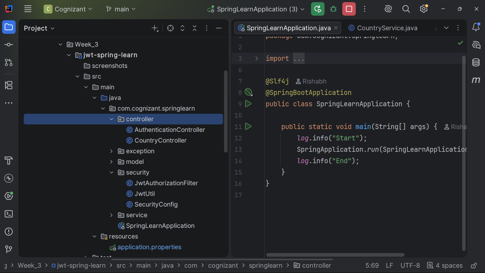

---

## Spring Boot Startup

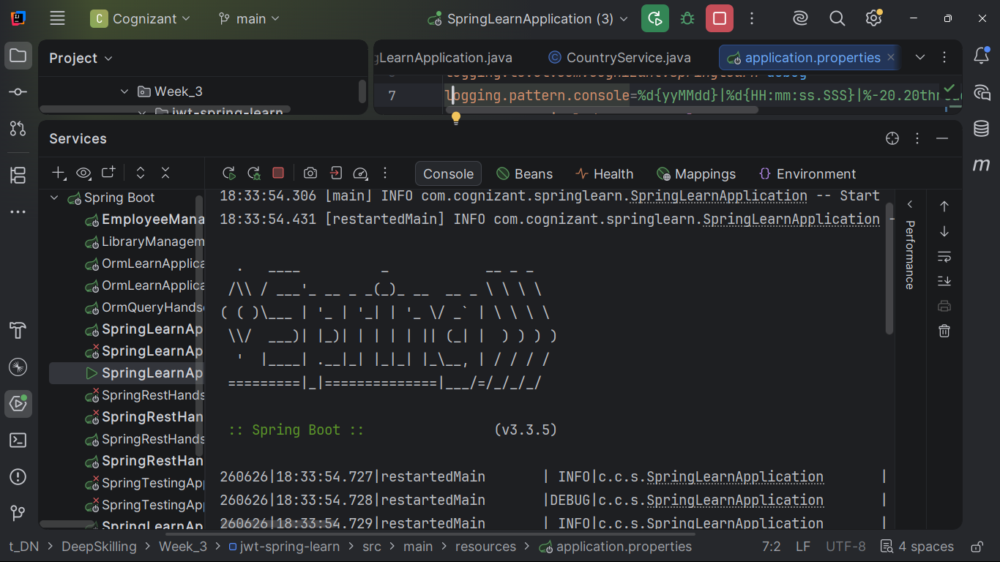

---

## Access Protected API Without Authentication (401 Unauthorized)

**GET**

```text
http://localhost:8090/countries
```

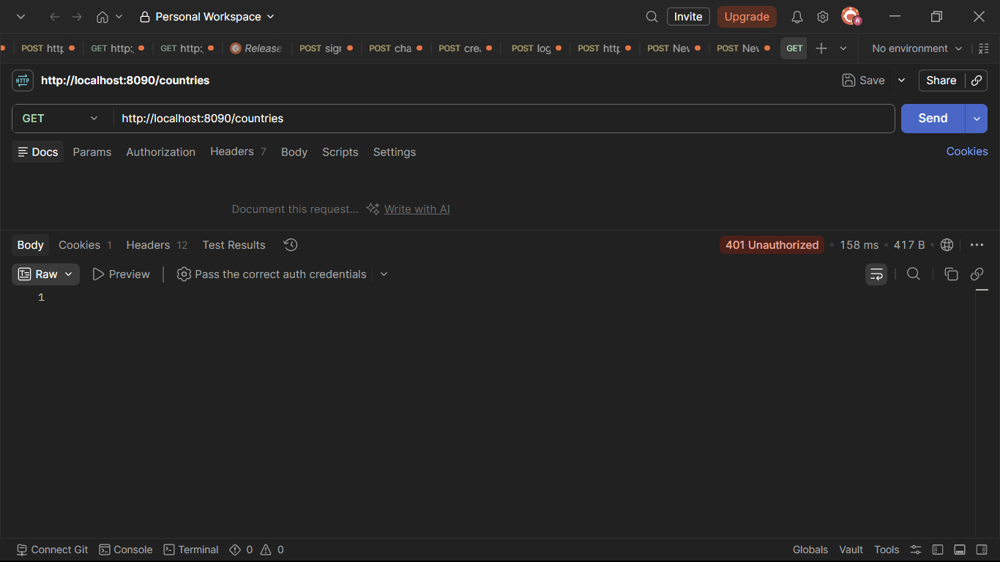

---

## Access Countries using USER Credentials

**GET**

```text
http://localhost:8090/countries
```

Authorization:

```text
Basic Auth

Username : user
Password : pwd
```

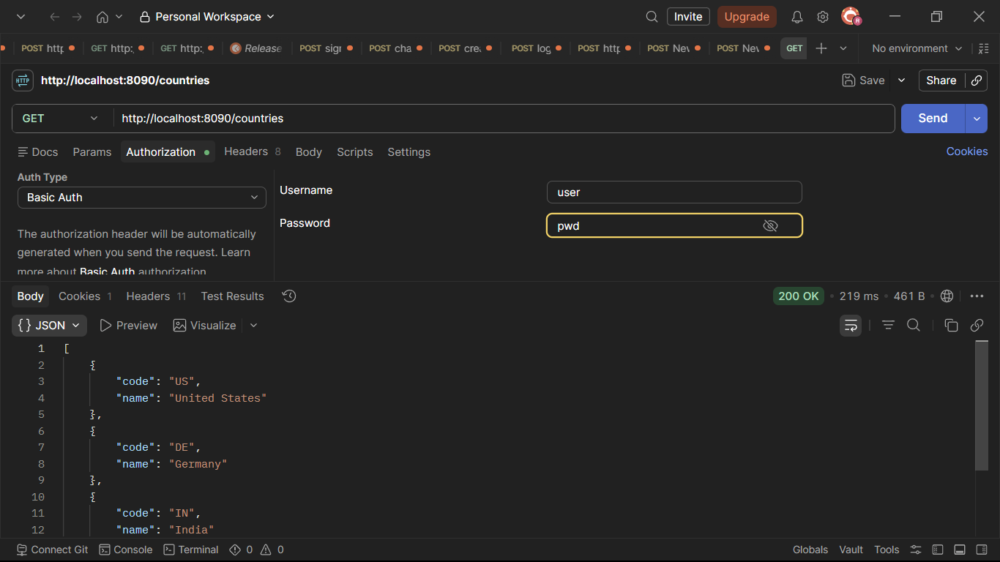

---

## Access Countries using ADMIN Credentials

**GET**

```text
http://localhost:8090/countries
```

Authorization:

```text
Basic Auth

Username : admin
Password : pwd
```

Expected:

```text
403 Forbidden
```


---

## Generate JWT Token

**GET**

```text
http://localhost:8090/authenticate
```

Authorization:

```text
Basic Auth

Username : user
Password : pwd
```

Expected Response

```json
{
  "token": "GENERATED_JWT_TOKEN"
}
```

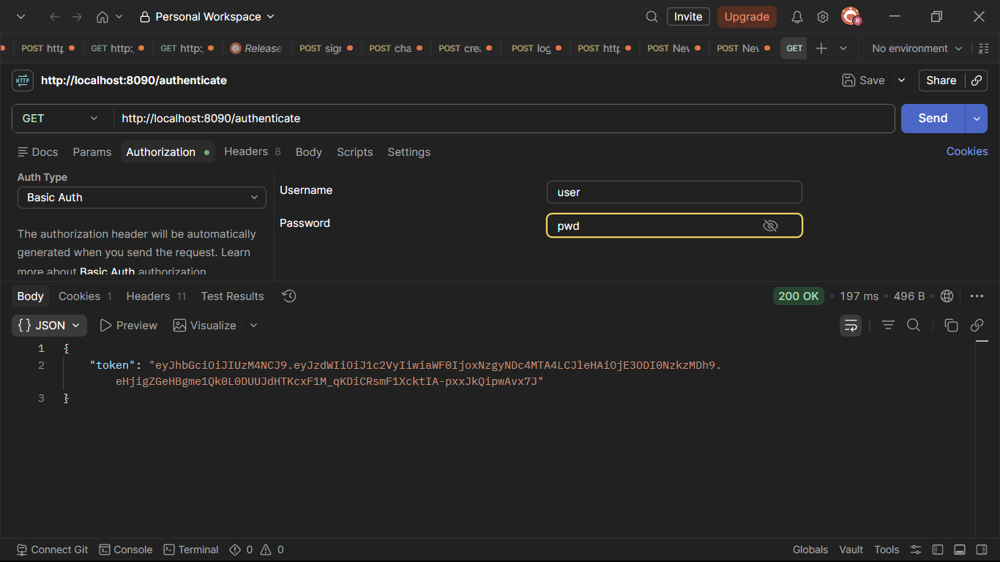

---

## Decode JWT Token using jwt.io

Open:

```text
https://jwt.io
```

Paste the generated JWT token.

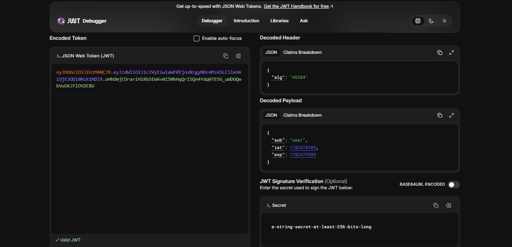

---

## Access Countries using JWT Bearer Token

**GET**

```text
http://localhost:8090/countries
```

Authorization:

```text
Bearer Token

<Generated JWT Token>
```

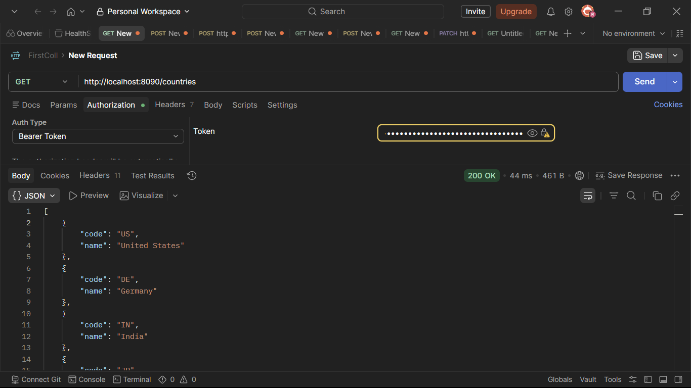

---

## Invalid JWT

**GET**

```text
http://localhost:8090/countries
```

Authorization:

```text
Bearer Token

invalid-token
```

Expected:

```text
401 Unauthorized
```

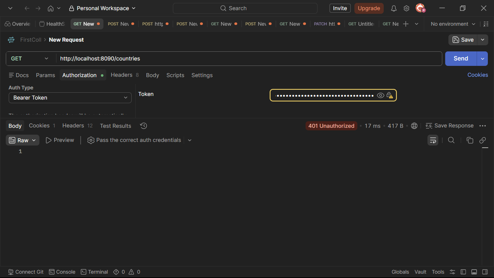

---

## SecurityConfig.java

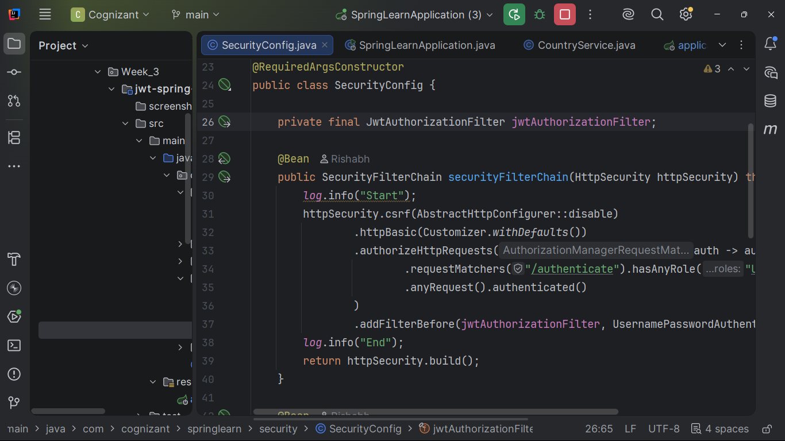

---

## AuthenticationController.java

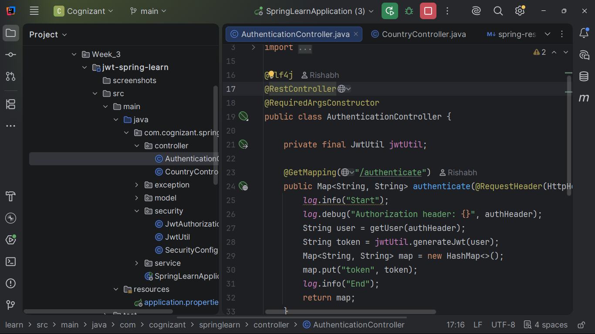

---

## JwtAuthorizationFilter.java

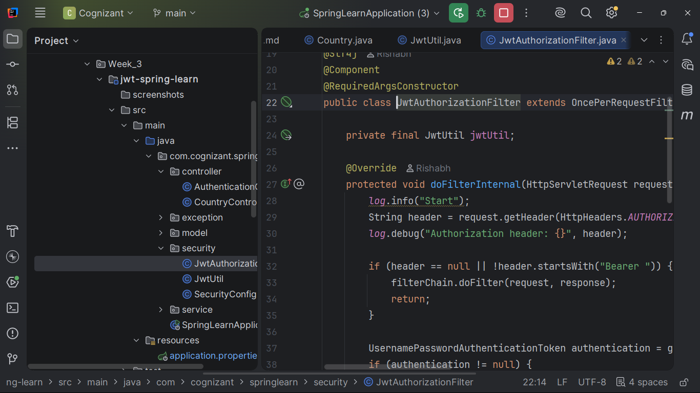

---

## JwtUtil.java

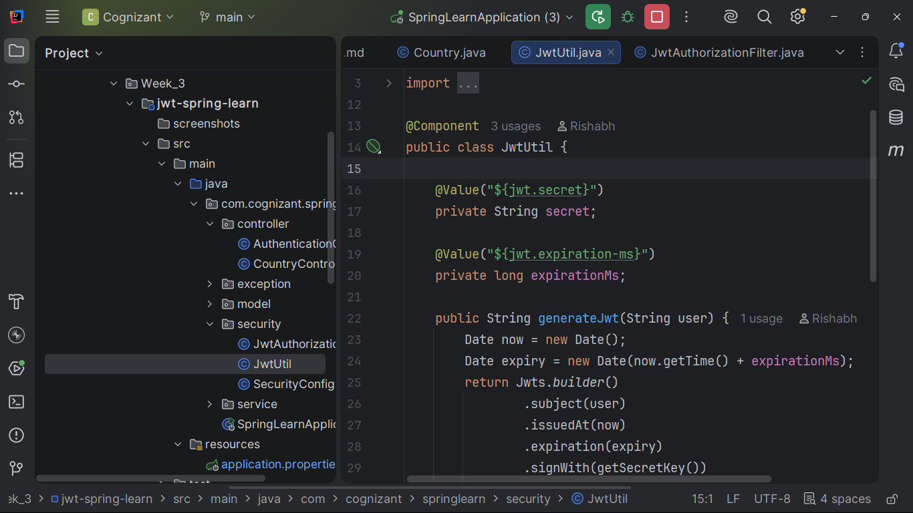

---

## Final Output

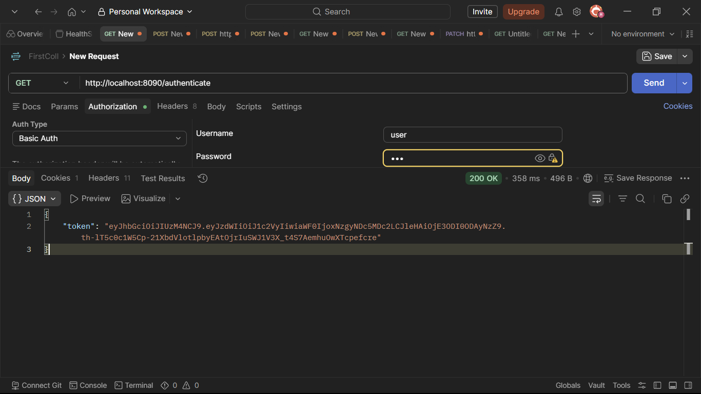

---

# Run Application

```bash
mvn clean spring-boot:run
```

Application runs on:

```text
http://localhost:8090
```

---

# Users

| Username | Password | Role    |
| -------- | -------- | ------- |
| `user`   | `pwd`    | `USER`  |
| `admin`  | `pwd`    | `ADMIN` |

---

# Test APIs

## 1. Try Protected API Without Authentication

```http
GET http://localhost:8090/countries
```

Expected:

```json
{
  "status": 401,
  "error": "Unauthorized"
}
```

---

## 2. Generate JWT Token

```http
GET http://localhost:8090/authenticate
```

Authorization:

```text
Basic Auth

Username : user
Password : pwd
```

Expected:

```json
{
  "token": "GENERATED_JWT_TOKEN"
}
```

---

## 3. Access Countries API with JWT

```http
GET http://localhost:8090/countries
```

Authorization:

```text
Bearer Token

<Generated JWT Token>
```

Expected:

```json
[
  {
    "code": "US",
    "name": "United States"
  },
  {
    "code": "DE",
    "name": "Germany"
  },
  {
    "code": "IN",
    "name": "India"
  },
  {
    "code": "JP",
    "name": "Japan"
  }
]
```

---

## 4. Test Invalid JWT

```http
GET http://localhost:8090/countries
```

Authorization:

```text
Bearer Token

invalid-token
```

Expected:

```json
{
  "status": 401,
  "error": "Unauthorized"
}
```
