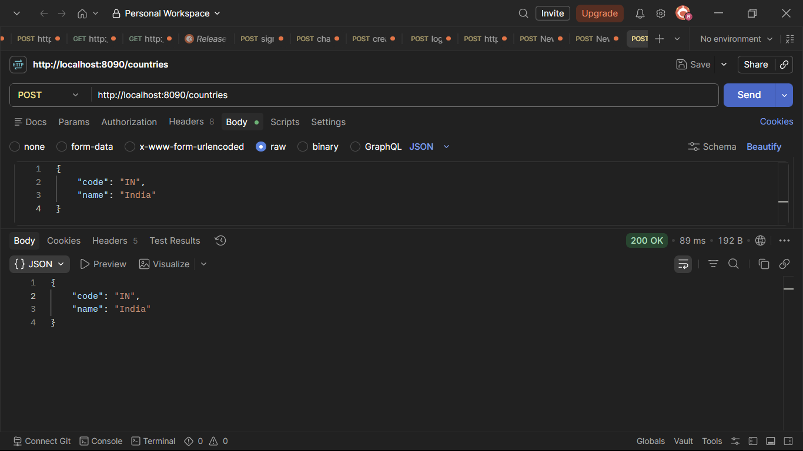
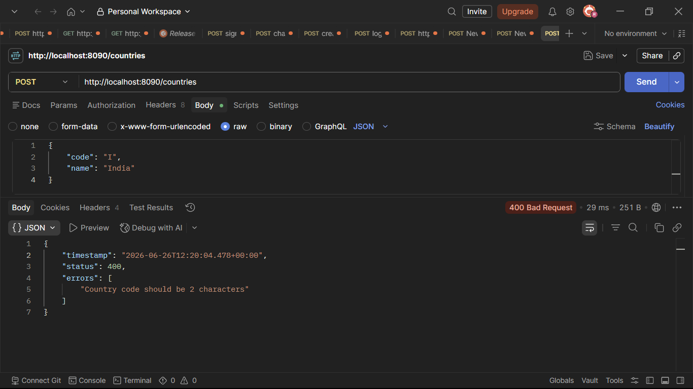
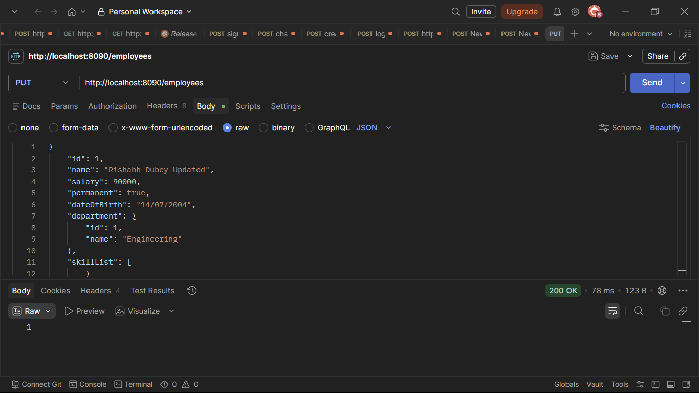
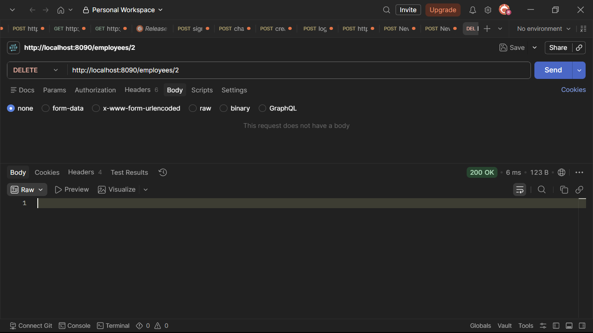
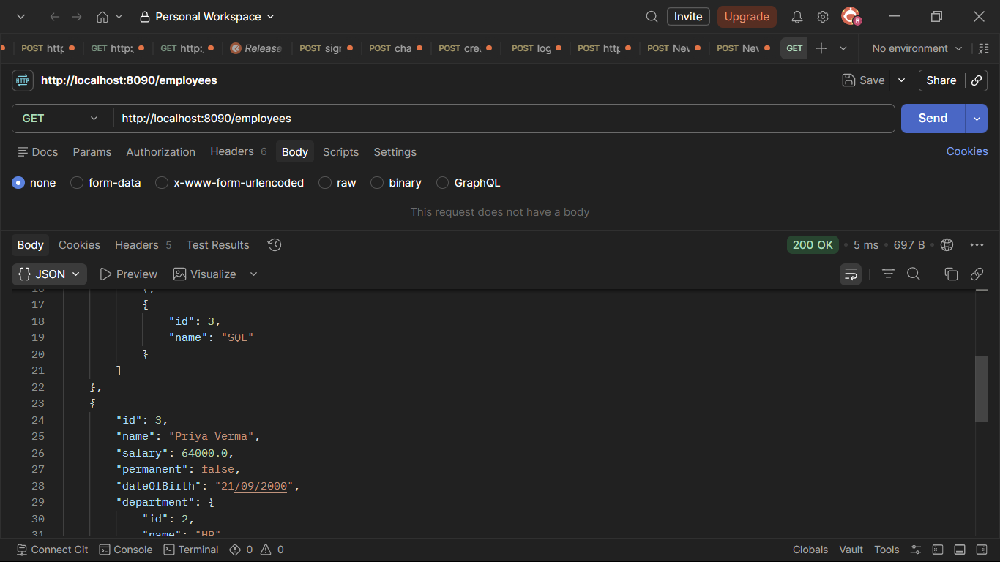
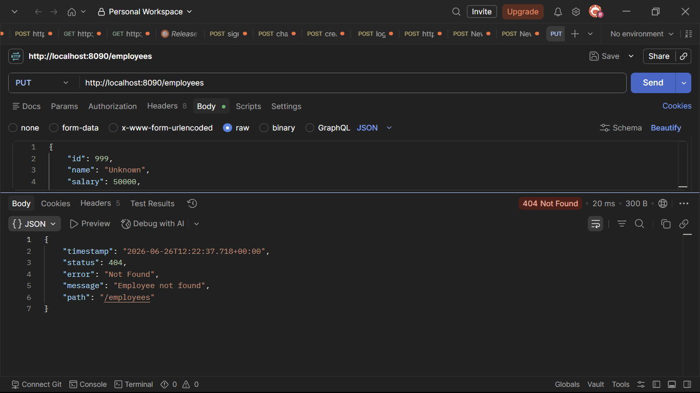
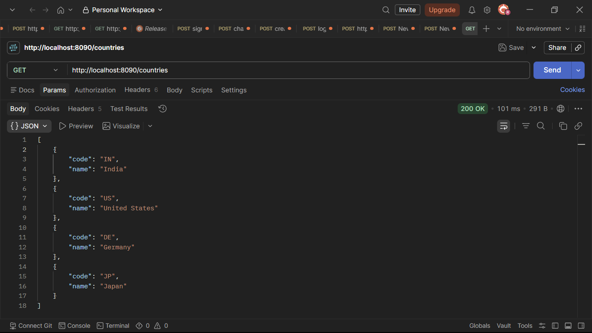
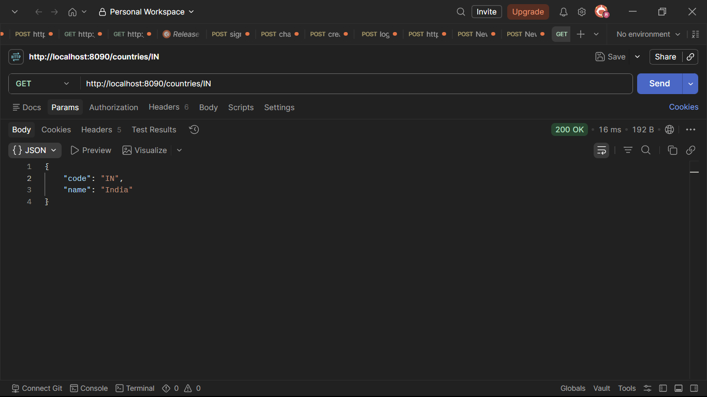
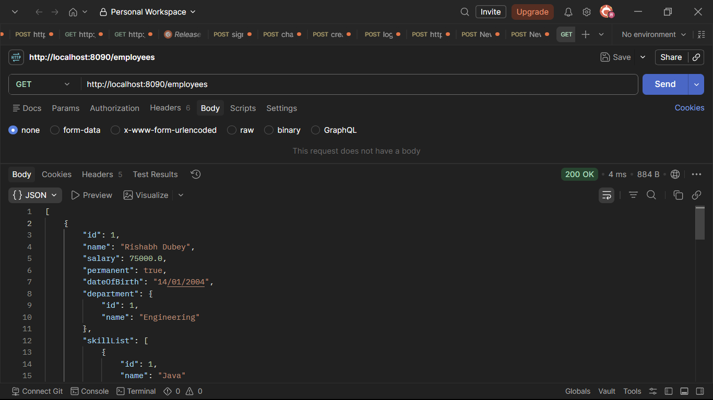
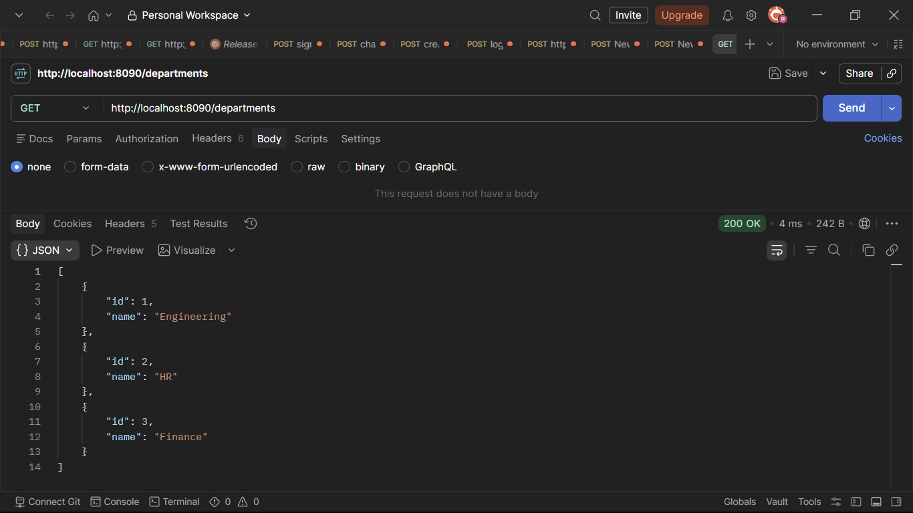

# Spring REST Hands-on 4

**Completed by:** Rajkaran

---

# Project Details

* **Application Name:** `spring-rest-handson-4`
* **Package Name:** `com.cognizant.springlearn`

---

# Hands-on Covered

## 1. HTTP Method Types

Implemented REST methods according to standard REST usage.

| Method | Purpose              |
| ------ | -------------------- |
| GET    | Fetch resource data  |
| POST   | Create resource data |
| PUT    | Update resource data |
| DELETE | Delete resource data |

---

## 2. RESTful URL Naming Guidelines

Country APIs use resource-based naming:

```java
@RequestMapping("/countries")
```

Employee APIs use:

```java
@RequestMapping("/employees")
```

Department APIs use:

```java
@RequestMapping("/departments")
```

---

# 3. Country POST Service

Implemented POST API for creating a country.

### Endpoint

```http
POST http://localhost:8090/countries
```

### Request Body

```json
{
  "code": "IN",
  "name": "India"
}
```

### Expected Response

```json
{
  "code": "IN",
  "name": "India"
}
```

### Postman Output

*Screenshot demonstrating the successful execution and response of this endpoint.*

---



---

# 4. JSON to Bean Mapping

Used `@RequestBody` to map JSON request data into the `Country` bean.

```java
public Country addCountry(@RequestBody @Valid Country country)
```

---

# 5. Country Validation

Validation added:

```java
@NotNull
@Size(min = 2, max = 2, message = "Country code should be 2 characters")
private String code;
```

### Invalid Request

```json
{
  "code": "I",
  "name": "India"
}
```

### Expected Response

```http
400 Bad Request
```

### Postman Output

*Screenshot demonstrating the successful execution and response of this endpoint.*

---



---

# 6. Global Exception Handler

Created global exception handler using:

```java
@ControllerAdvice
```

Handled:

* Validation Exceptions
* Invalid Request Body
* Employee Not Found Exception

---

# 7. Employee Update Service

Implemented PUT API.

### Endpoint

```http
PUT http://localhost:8090/employees
```

### Request Body

```json
{
  "id": 1,
  "name": "Rajkaran Updated",
  "salary": 90000,
  "permanent": true,
  "dateOfBirth": "14/07/2004",
  "department": {
    "id": 1,
    "name": "Engineering"
  },
  "skillList": [
    {
      "id": 1,
      "name": "Java"
    },
    {
      "id": 3,
      "name": "SQL"
    }
  ]
}
```

### Expected Response

```http
200 OK
```

### Postman Output

*Screenshot demonstrating the successful execution and response of this endpoint.*

---



---

## Verify Employee Update

```http
GET http://localhost:8090/employees
```

### Postman Output

*Screenshot demonstrating the successful execution and response of this endpoint.*

---


---

# 8. Employee Delete Service

Implemented DELETE API.

### Endpoint

```http
DELETE http://localhost:8090/employees/1
```

### Expected Response

```http
200 OK
```

### Postman Output

*Screenshot demonstrating the successful execution and response of this endpoint.*

---



---

## Verify Employee Delete

```http
GET http://localhost:8090/employees
```

### Postman Output

*Screenshot demonstrating the successful execution and response of this endpoint.*

---



---

# 9. Employee Not Found Exception

Created:

```java
@ResponseStatus(value = HttpStatus.NOT_FOUND, reason = "Employee not found")
```

### Invalid Update

```http
PUT http://localhost:8090/employees
```

### Expected Response

```http
404 Not Found
```

### Postman Output

*Screenshot demonstrating the 404 Not Found error when updating a non-existent employee.*

---



---

### Invalid Delete

```http
DELETE http://localhost:8090/employees/999
```

### Expected Response

```http
404 Not Found
```

### Postman Output

*Screenshot demonstrating the 404 Not Found error when deleting a non-existent employee.*

---


---

# 10. MockMvc Tests

Created MockMvc tests for:

* Application Context Loading
* Country Validation
* Employee Update Exceptional Scenario
* Employee Delete Exceptional Scenario

Run tests using:

```bash
mvn clean test
```

---

# Postman URLs

## Country APIs

### Get All Countries

```http
GET http://localhost:8090/countries
```

---



---

### Get Country By Code

```http
GET http://localhost:8090/countries/IN
```

---



---

### Add Country

```http
POST http://localhost:8090/countries
```

```json
{
  "code": "IN",
  "name": "India"
}
```

---


---

### Country Validation

```http
POST http://localhost:8090/countries
```

```json
{
  "code": "I",
  "name": "India"
}
```

*Demonstrates a 400 Bad Request (Validation Error) because the country code is only 1 character instead of exactly 2.*

---


---

## Employee APIs

### Get All Employees

```http
GET http://localhost:8090/employees
```

---



---

### Update Employee

```http
PUT http://localhost:8090/employees
```

```json
{
  "id": 1,
  "name": "Rajkaran Updated",
  "salary": 90000,
  "permanent": true,
  "dateOfBirth": "14/07/2004",
  "department": {
    "id": 1,
    "name": "Engineering"
  },
  "skillList": [
    {
      "id": 1,
      "name": "Java"
    },
    {
      "id": 3,
      "name": "SQL"
    }
  ]
}
```

---


---

### Verify Employee Update

```http
GET http://localhost:8090/employees
```

---


---

### Update Employee Exception

```http
PUT http://localhost:8090/employees
```

```json
{
  "id": 999,
  "name": "Unknown",
  "salary": 50000,
  "permanent": true,
  "dateOfBirth": "14/07/2004",
  "department": {
    "id": 1,
    "name": "Engineering"
  },
  "skillList": [
    {
      "id": 1,
      "name": "Java"
    }
  ]
}
```

*Demonstrates a 404 Not Found error because the requested employee ID to update does not exist.*

---


---

### Delete Employee

```http
DELETE http://localhost:8090/employees/1
```

---


---

### Verify Employee Delete

```http
GET http://localhost:8090/employees
```

---


---

### Delete Employee Exception

```http
DELETE http://localhost:8090/employees/999
```

*Demonstrates a 404 Not Found (EmployeeNotFoundException) because the requested employee ID (999) does not exist.*

---


---

## Department API

### Get All Departments

```http
GET http://localhost:8090/departments
```

---



---

---


