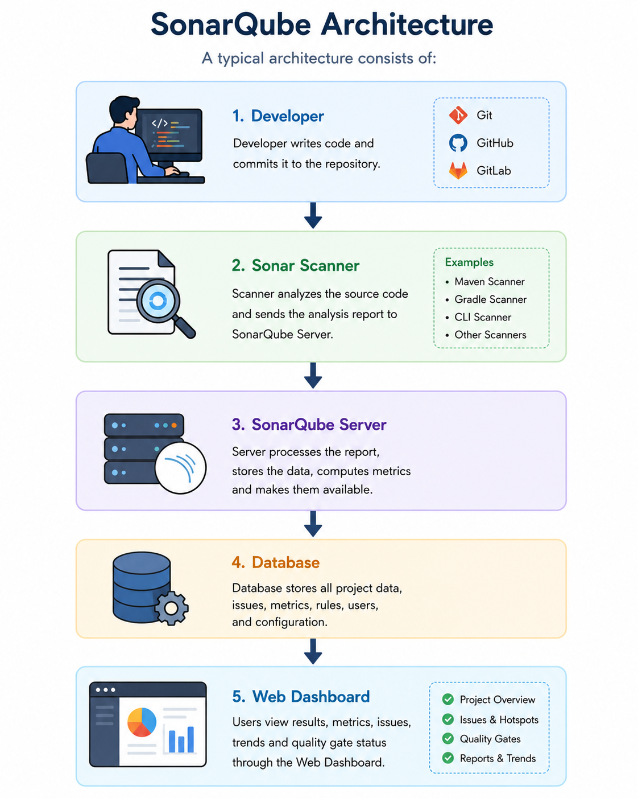
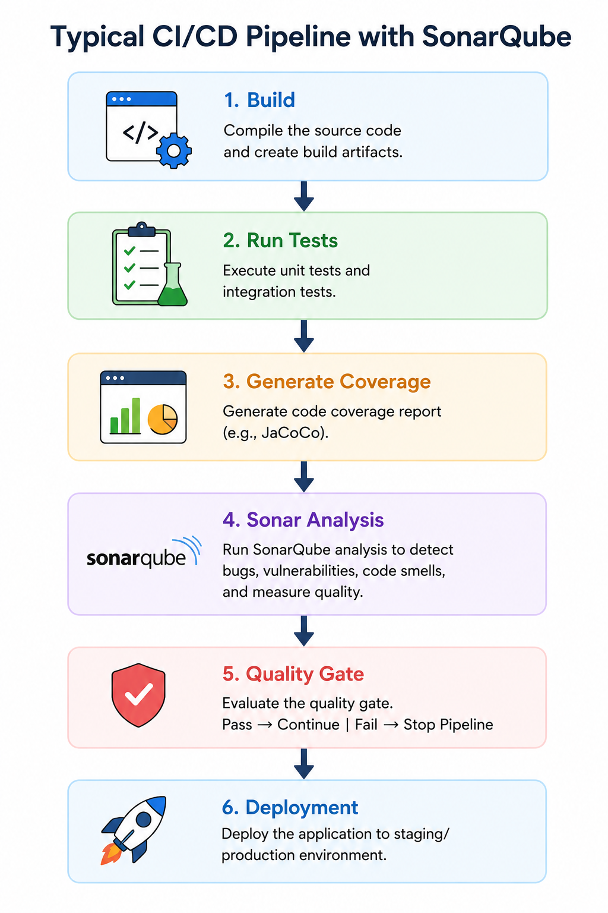
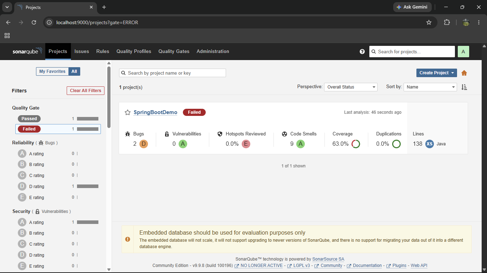

# Week 4: Microservices & Code Quality

**Welcome to the Week 4 exercises of the Cognizant Digital Nurture (Java FSE) program!**  
This directory contains all the microservices architecture, API gateways, load balancers, and static code analysis (SonarQube) projects.

---

## Topics Covered
* **Code Quality & SonarQube:** Static code analysis, code coverage, and quality gates.
* **Microservices with Spring Boot 3:** Decoupled architecture and inter-service communication.
* **Spring Cloud:** Service discovery, API Gateway, and centralized configuration.
* **Edge Services:** Client-side load balancing and resilience patterns.

---

# Project Portfolio & Architecture Gallery

*Below is a comprehensive visual gallery of the architectures and successful execution outputs for all projects built in Week 4.*

---

## 1. Spring Boot Microservices
*Demonstrating synchronous and asynchronous inter-service communication, service discovery, and circuit breakers.*

### User & Order Service

  

 

### Inventory Service

  

  

 

### API Gateway (Internal)

  

 

### Circuit Breaker (Resilience4j)

  

---

## 2. Microservices with API Gateway
*A complete distributed system utilizing Netflix Eureka and Spring Cloud Gateway.*

### Core Services

  

  

 

### Eureka Service Discovery

  

 

### Global API Gateway & Logging

  

---

## 3. Load Balancing & Edge Services
*Demonstrating load balancing and routing through Edge Services.*

### Routing & Filtering

 

### Load Balancing

 

### Resilience Patterns

---

## 4. Centralized Authentication (OAuth2/OIDC)
*Securing microservices using Spring Security and OAuth 2.1.*

### Authentication Outputs

  

  

---

## 5. SonarQube Code Quality Analysis
*Static code analysis, code coverage, and quality gates using SonarQube running locally on Docker.*

### SonarQube Setup & Configuration

  

  

  

 

### Initial Code Scan (Failing Quality Gate)

  

  

  

  

  

  

  

 

### After Issue Resolution (Passing Quality Gate)

  

  

  

