# Week 4: Microservices & Code Quality

Welcome to the Week 4 exercises of the Cognizant Digital Nurture (Java FSE) program. This directory contains all the microservices architecture, API gateways, load balancers, and static code analysis (SonarQube) projects.

## Topics Covered:
* **Code Quality & SonarQube:** Static code analysis and code coverage
* **Microservices with Spring Boot 3:** Decoupled architecture and inter-service communication
* **Spring Cloud:** Service discovery, API Gateway, and centralized configuration
* **Edge Services:** Client-side load balancing and resilience patterns

---

## Project Portfolio & Architecture Gallery

Below is a comprehensive visual gallery of the architectures and successful execution outputs for all projects built in Week 4.

### 1. Spring Boot Microservices
Demonstrating synchronous and asynchronous inter-service communication, service discovery, and circuit breakers.

**User & Order Service**

**Inventory Service**
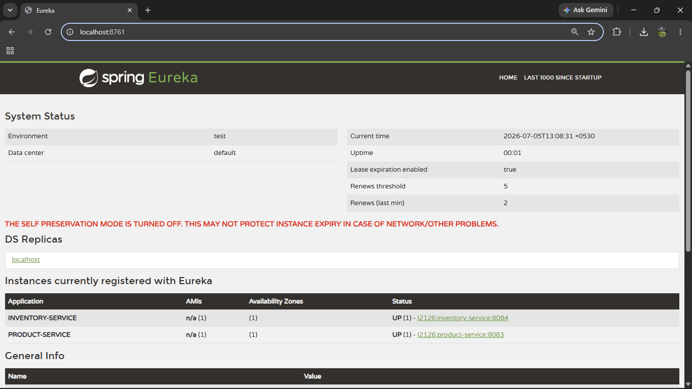
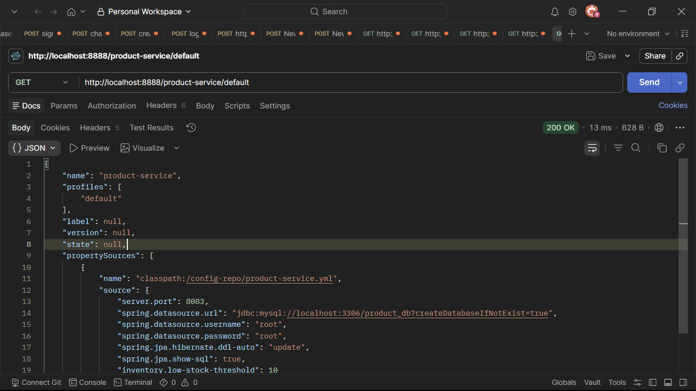

**API Gateway (Internal)**
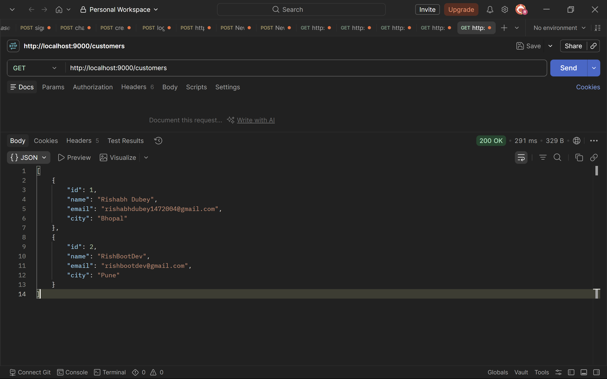
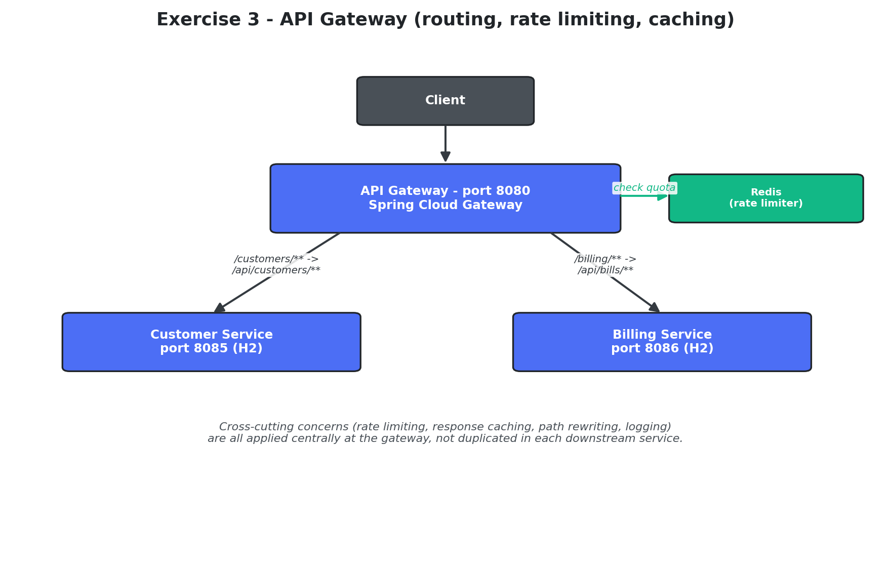

**Circuit Breaker (Resilience4j)**
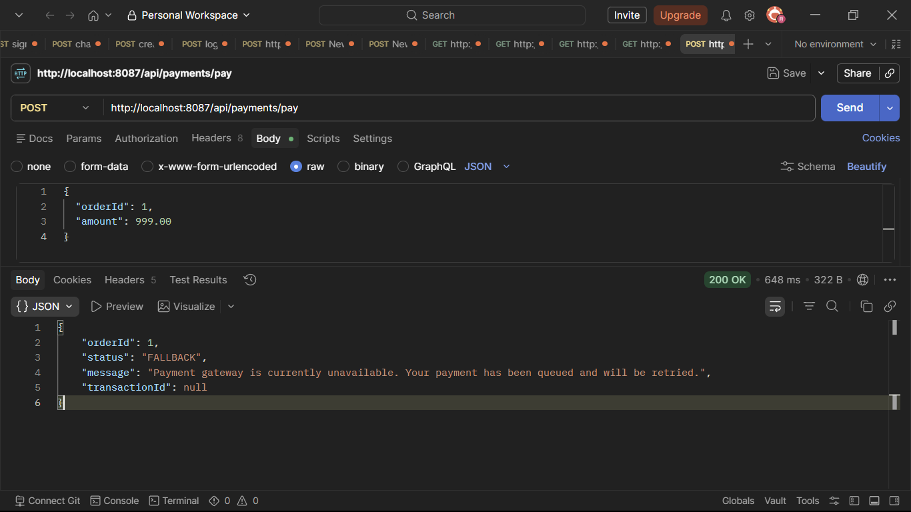

---

### 2. Microservices with API Gateway
A complete distributed system utilizing Netflix Eureka and Spring Cloud Gateway.

**Core Services**

**Eureka Service Discovery**

**Global API Gateway & Logging**

---

### 3. Load Balancing & Edge Services
Demonstrating load balancing and routing through Edge Services.

**Routing & Filtering**
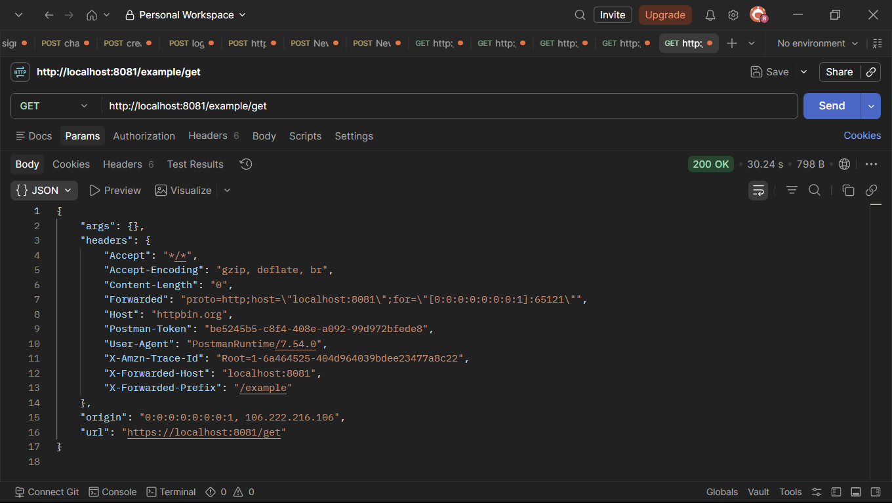

**Load Balancing**
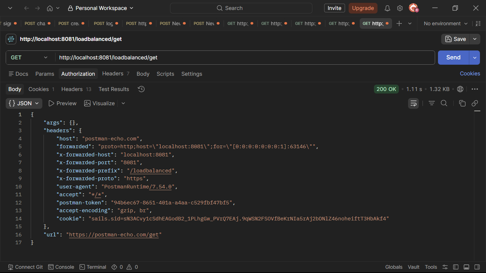

**Resilience Patterns**
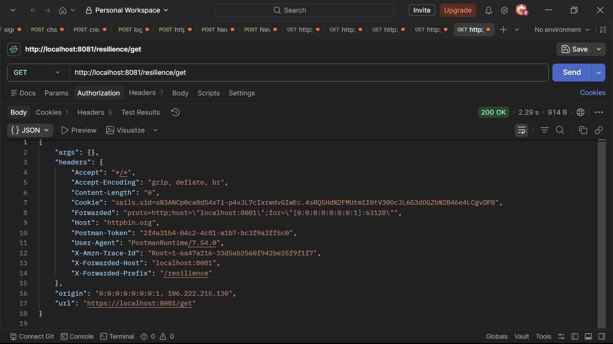

---

### 4. Centralized Authentication (OAuth2/OIDC)
Securing microservices using Spring Security and OAuth 2.1.

**Authentication Outputs**
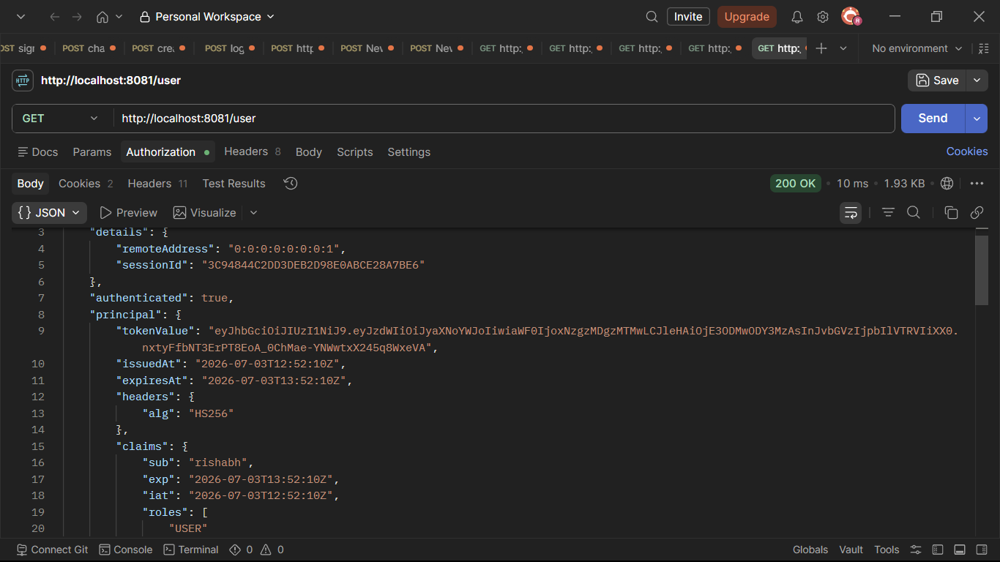

---

### 5. SonarQube Code Quality Analysis
Static code analysis, code coverage, and quality gates using SonarQube running locally on Docker.

**SonarQube Setup**

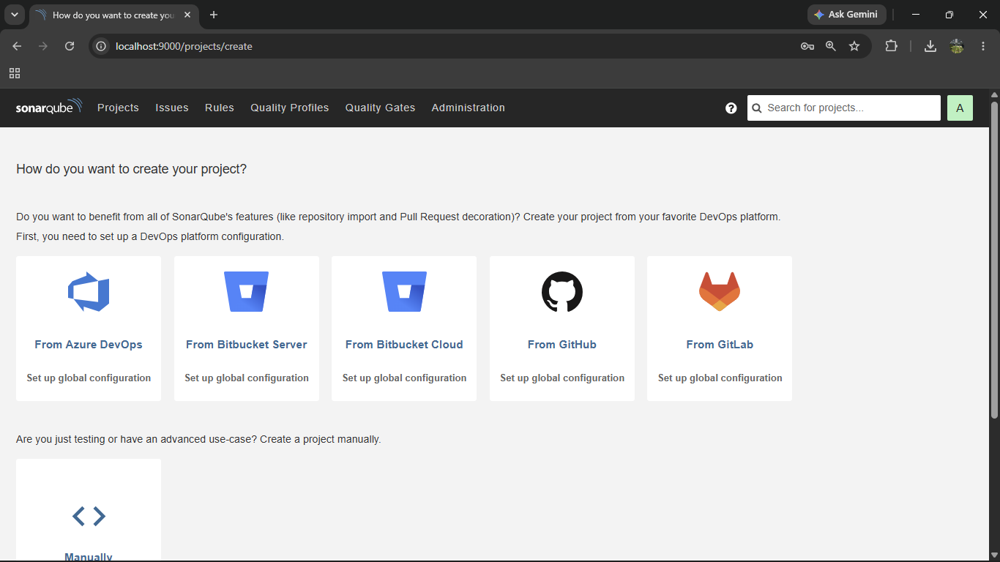

**Initial Code Scan (Failing Quality Gate)**

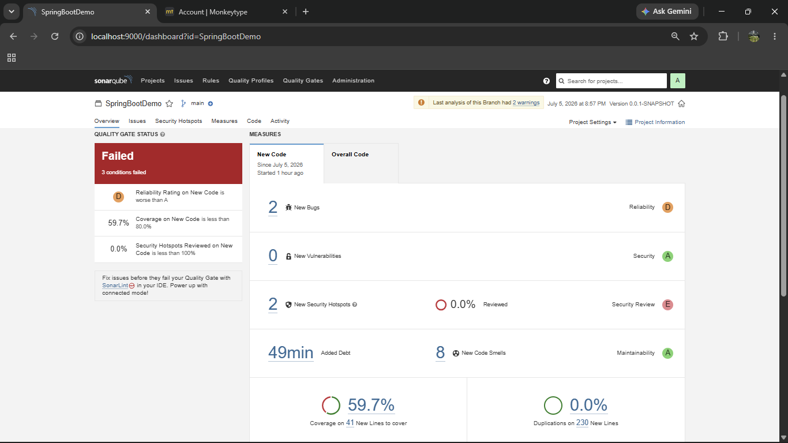

**After Issue Resolution (Passing Quality Gate)**
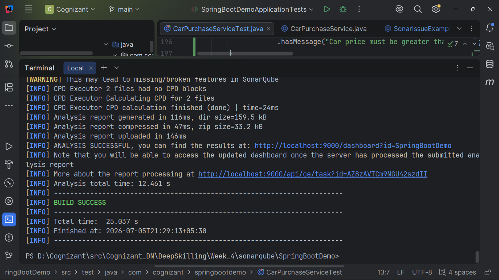

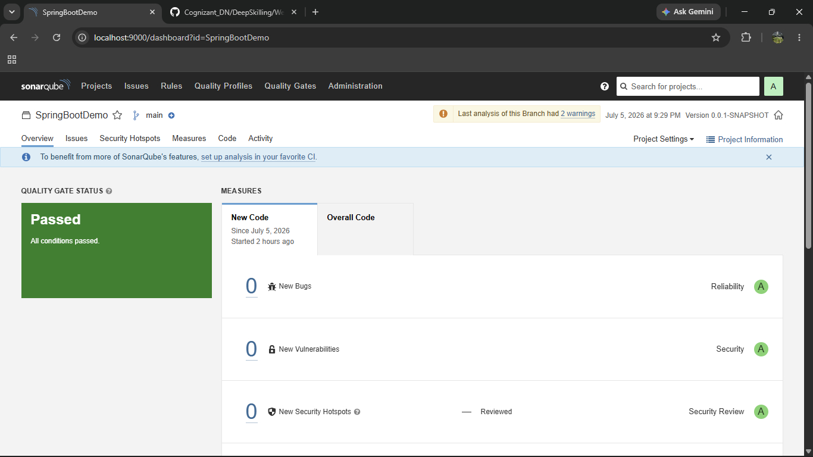
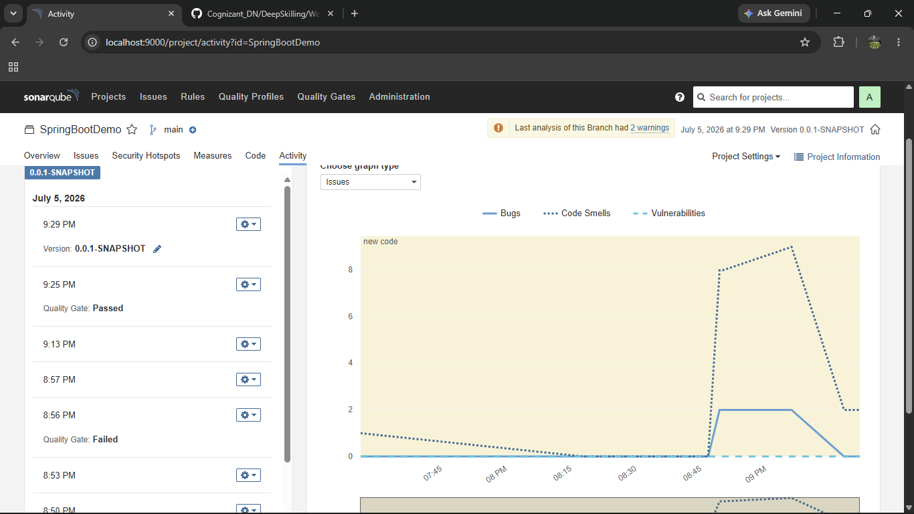
