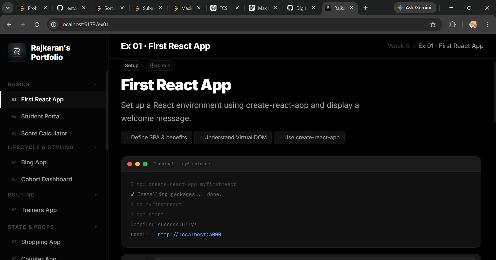
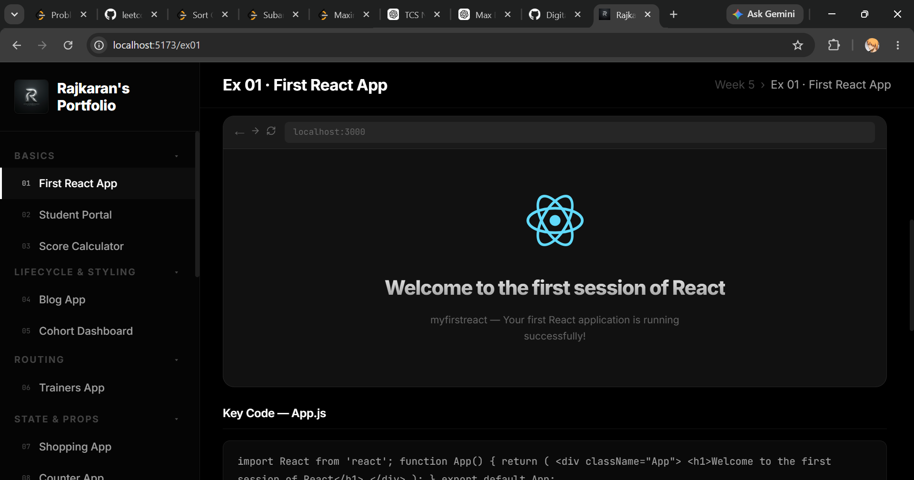
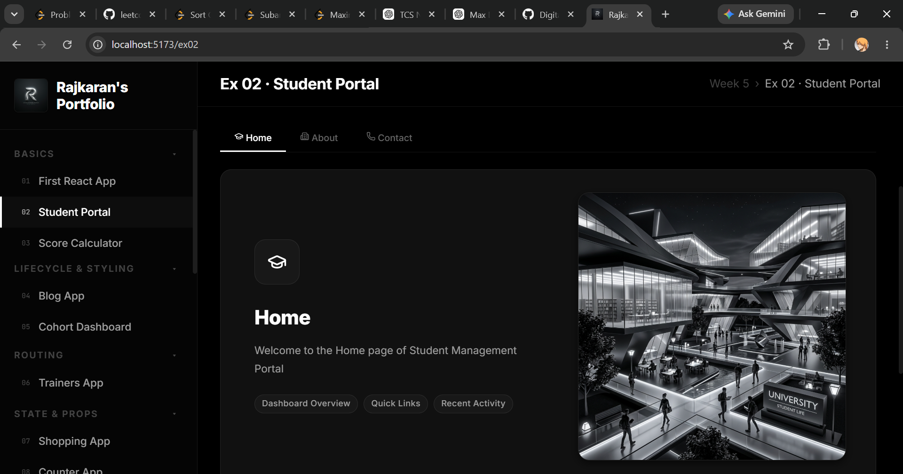
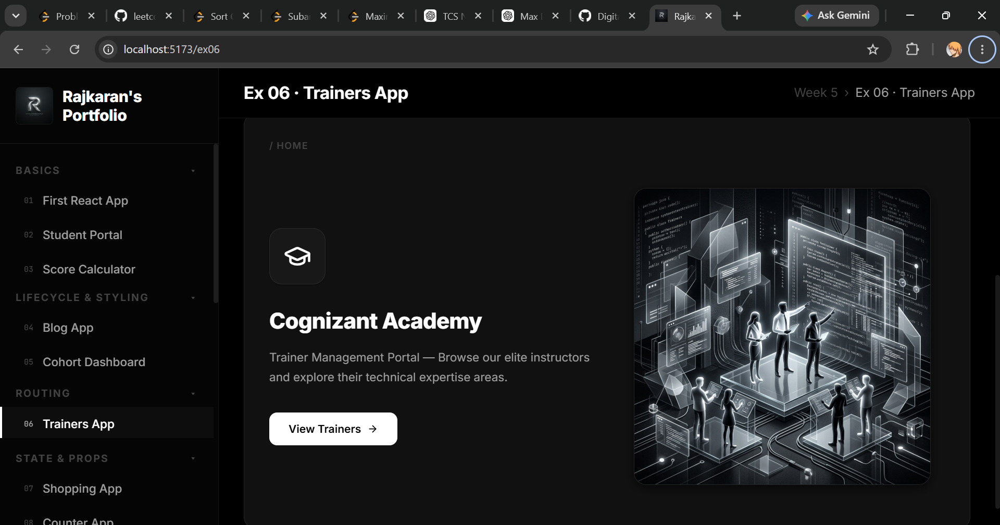
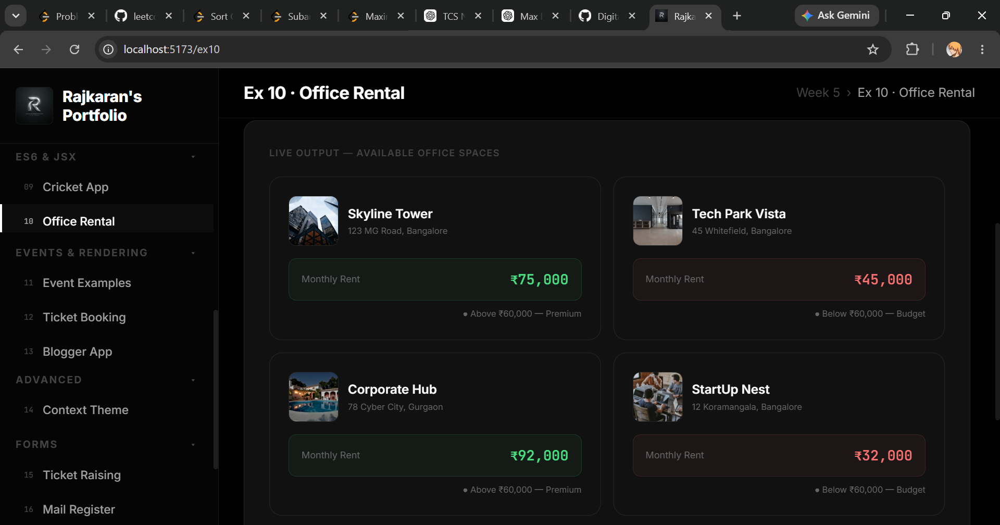
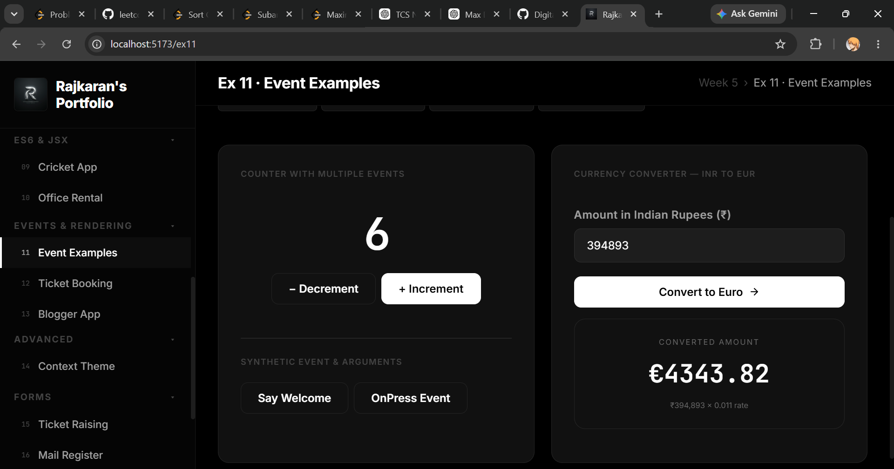
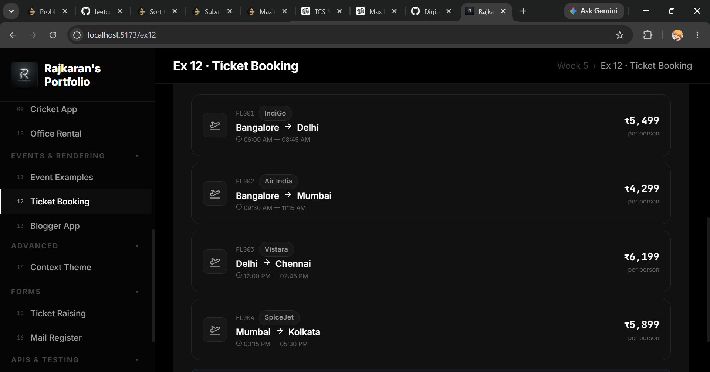
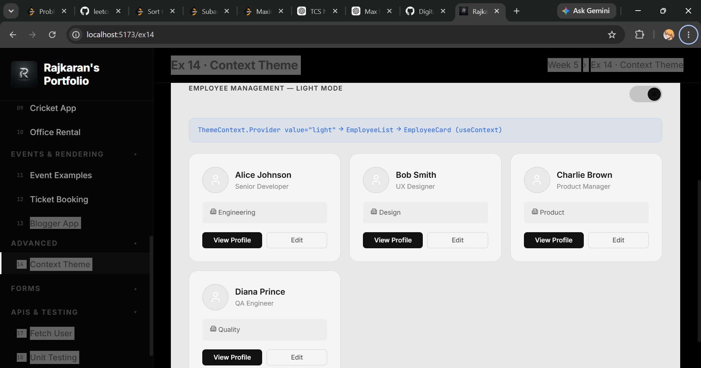
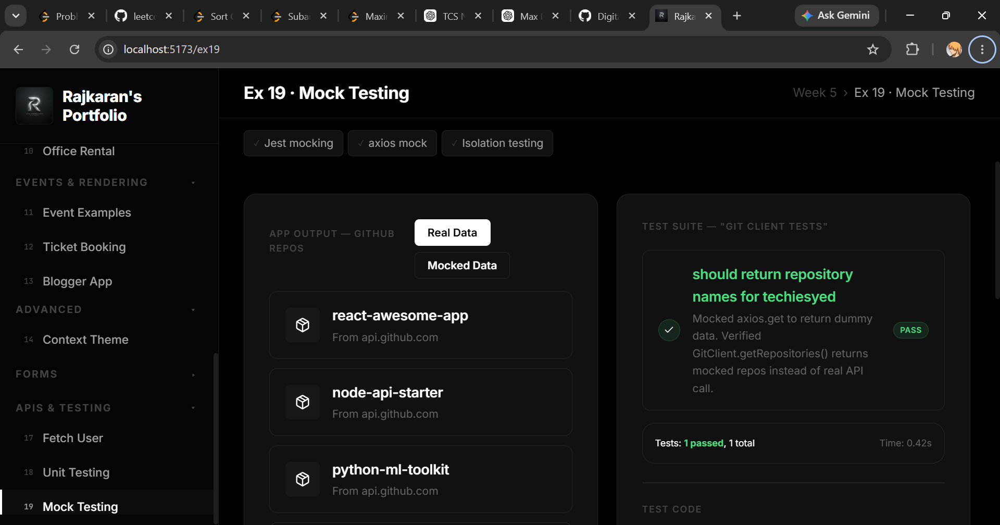

<div>
#### Rajkaran's React Masterclass

**Welcome to the Week 5 ReactJS Portfolio of Rajkaran Yadav!**  
This directory contains 19 hands-on exercises covering the entire spectrum of React fundamentals — from component architecture to state management, routing, Context API, REST APIs, and automated testing.

---

## Technologies & Skills

* **Core React:** JSX, Functional & Class Components, Lifecycle Hooks, Hooks (useState, useEffect)
* **Routing & State:** React Router v6, URL Parameters, Context API, Conditional Rendering
* **Styling & UI:** CSS Modules, Dynamic Inline Styling, Lucide Icons, Glassmorphism UI
* **Forms & APIs:** Real-time Form Validation, Fetch API, REST Integration, Mock Axios Calls
* **Testing:** Jest, Enzyme Unit Testing, Spy Assertions

---
</div>

<div>

# Portfolio Gallery

*Below is a comprehensive visual gallery showcasing the breathtaking dark-themed UI and functionality of my React applications.*

<br/>
<br/>

### 1. Masterclass Dashboard


<br/>
<br/>
<br/>

### 2. Ex 01 - First React App (Setup)



<br/>
<br/>
<br/>

### 3. Ex 01 - First React App (Demo)



<br/>
<br/>
<br/>

### 4. Ex 02 - Student Portal



<br/>
<br/>
<br/>

### 5. Ex 06 - Trainers App



<br/>
<br/>
<br/>

### 6. Ex 10 - Office Rental



<br/>
<br/>
<br/>

### 7. Ex 11 - Event Examples



<br/>
<br/>
<br/>

### 8. Ex 12 - Ticket Booking



<br/>
<br/>
<br/>

### 9. Ex 14 - Context Theme



<br/>
<br/>
<br/>

### 10. Ex 17 - Fetch User


<br/>
<br/>
<br/>

### 11. Ex 18 - Unit Testing


<br/>
<br/>
<br/>

### 12. Ex 19 - Mock Testing



</div>

<br/>
<br/>
<br/>

## Instructions to Run

To run this masterclass portfolio locally on your machine, simply execute the following commands:

```bash
# 1. Navigate to the project directory
cd "Deep Skilling/Week_5"

# 2. Install all dependencies
npm install

# 3. Start the Vite development server
npm run dev
```

> **Note**: The application will run on `http://localhost:5173/` and features hot-module reloading for instantaneous UI updates.

---
<div align="center">
<i>Engineered with precision by <b>Rajkaran Yadav</b></i>
</div>
