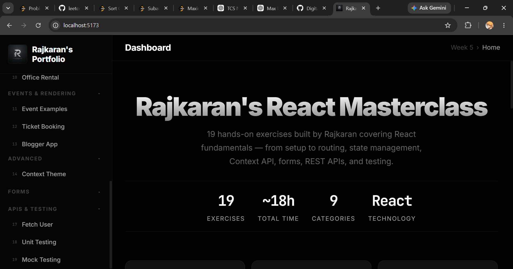
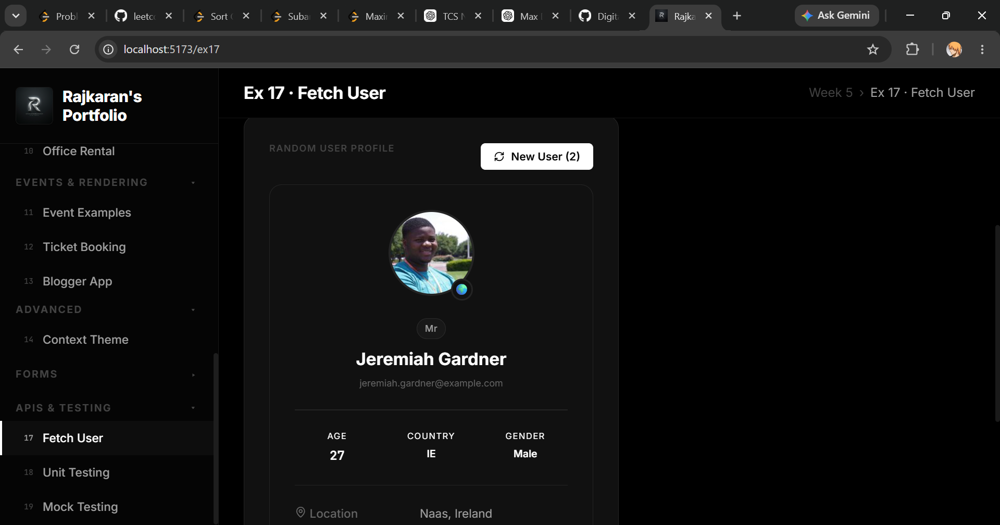
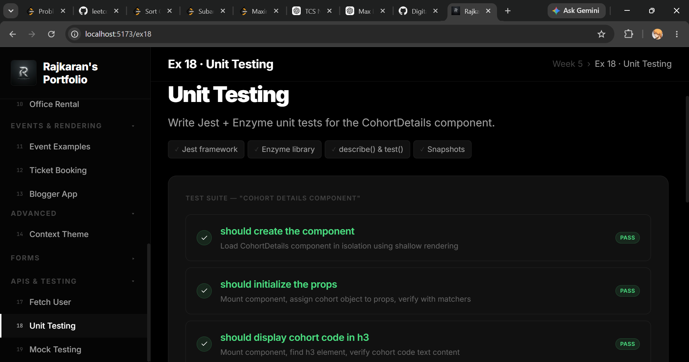

<p align="center">

---

  

---

</p>

# Welcome to the Week 6 ReactJS Portfolio of Rajkaran Yadav!  
This directory contains 6 hands-on exercises covering advanced React fundamentals — from Context API, forms, REST APIs, to automated testing.

---

## Technologies & Skills

* **Core React:** JSX, Functional & Class Components, Lifecycle Hooks, Hooks (useState, useEffect)
* **Routing & State:** React Router v6, URL Parameters, Context API, Conditional Rendering
* **Styling & UI:** CSS Modules, Dynamic Inline Styling, Lucide Icons, Glassmorphism UI
* **Forms & APIs:** Real-time Form Validation, Fetch API, REST Integration, Mock Axios Calls
* **Testing:** Jest, Enzyme Unit Testing, Spy Assertions

---

# Portfolio Gallery

*Below is a visual gallery showcasing the UI and functionality of my advanced React applications.*

<br/>
<br/>

### 1. Masterclass Dashboard

---



---

<br/>
<br/>
<br/>

### 2. Ex 14 - Context Theme

---


---

<br/>
<br/>
<br/>


### 3. Ex 17 - Fetch User

---



---

<br/>
<br/>
<br/>


### 4. Ex 18 - Unit Testing

---



---

<br/>
<br/>
<br/>


### 5. Ex 19 - Mock Testing

---


---

<br/>
<br/>
<br/>

---

## Instructions to Run

To run this masterclass portfolio locally on your machine, simply execute the following commands:

```bash
# 1. Navigate to the project directory
cd "Deep Skilling/Week_6"

# 2. Install all dependencies
npm install

# 3. Start the Vite development server
npm run dev
```

> **Note**: The application will run on `http://localhost:5173/` and features hot-module reloading for instantaneous UI updates.


<i>Engineered with precision by <b>Rajkaran Yadav</b></i>
